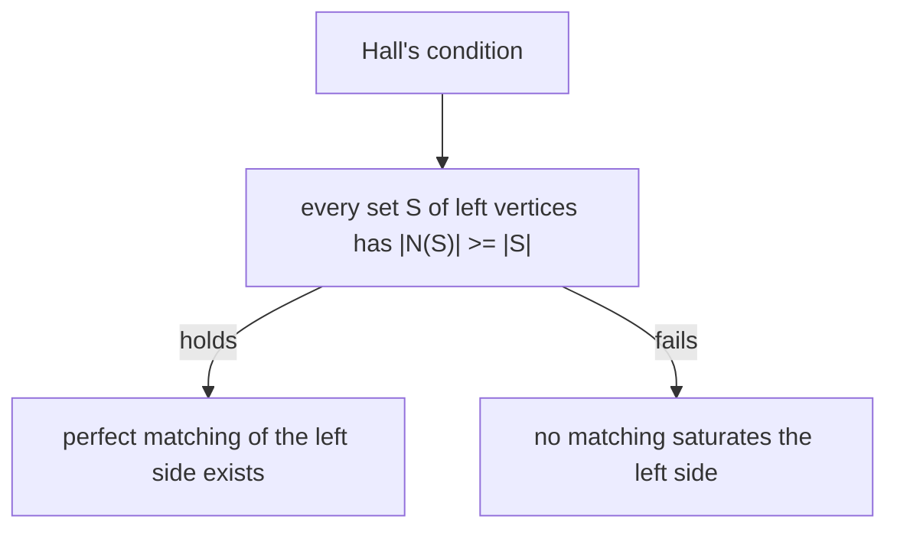

# 이분 매칭과 홀의 정리 (Bipartite Matching, Hall's Theorem)

*(English: [Bipartite Matching & Hall's Theorem](/portfolio/study/bipartite-matching/))*

> 매칭은 끝점이 겹치지 않게 정점을 짝지으며, 홀의 조건이 한쪽을 완전히 매칭할 수 있는 정확한 기준이다.

## 개념
이분 그래프 $L\cup R$ 에서 **매칭(matching)** 은 정점을 공유하지 않는 간선 집합이다. 왼쪽
정점이 모두 매칭되면 $L$ 을 **포화(saturate)** 한다. **홀의 정리:** 이것이 가능한 것은 모든
$S\subseteq L$ 에 대해 $|N(S)|\ge|S|$ (이웃이 충분히 큼)일 때와 동치다.

## 왜 중요한가
배정 문제의 모델이다: 일↔작업자, 학생↔프로젝트, 안정 결혼 문제. 홀의 조건이 깔끔한 가부
판정이다.

## 세부
홀의 조건 실패는 어떤 왼쪽 정점 집합이 이웃을 너무 적게 공유함 — "병목" 장애물 — 을 뜻한다.
매칭은 증대경로로 찾으며, 이는 최대유량의 이분 특수 경우다.

## 다이어그램

## 관련
[네트워크 흐름과 최대유량-최소절단 (Network Flow, Max-Flow Min-Cut)](/portfolio/study/network-flow.ko/) · [그래프 기초: 보행·경로·연결성](/portfolio/study/graphs-basics.ko/) · [그래프 색칠 (Graph Coloring)](/portfolio/study/graph-coloring.ko/)
