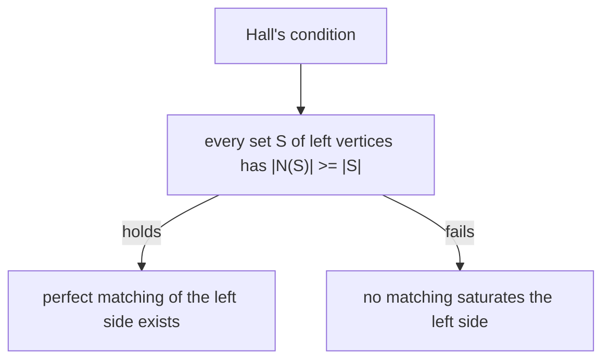

# Bipartite Matching & Hall's Theorem

*(한국어: [이분 매칭과 홀의 정리 (Bipartite Matching, Hall's Theorem)](/portfolio/study/bipartite-matching.ko/))*

> A matching pairs up vertices with no shared endpoints; Hall's condition tells exactly when one side can be fully matched.

## Idea
In a bipartite graph $L\cup R$, a **matching** is a set of edges with no shared vertex. A
matching **saturates** $L$ if every left vertex is matched. **Hall's theorem:** this is
possible iff for every $S\subseteq L$, $|N(S)|\ge|S|$ (the neighborhood is big enough).

## Why it matters
The model for assignment problems: jobs to workers, students to projects, the stable-marriage
setting. Hall's condition is the clean yes/no test.

## Details
Failing Hall's condition means some set of left vertices shares too few neighbors — a
"bottleneck" obstruction. Matchings are found via augmenting paths, the bipartite special
case of max-flow.

## Diagram

## Related
[Network Flow & Max-Flow Min-Cut](/portfolio/study/network-flow/) · [Graphs: Walks, Paths & Connectivity](/portfolio/study/graphs-basics/) · [Graph Coloring](/portfolio/study/graph-coloring/)
