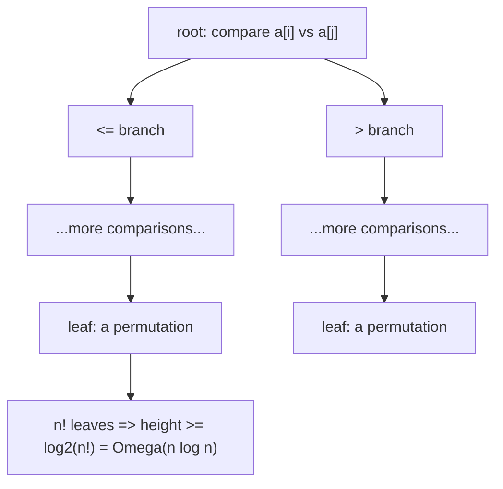

# 비교 정렬과 그 하한 (Comparison Sorting, Lower Bound)

*(English: [Comparison Sorting & Its Lower Bound](/portfolio/study/comparison-sorting/))*

> 항목을 쌍 비교로만 정렬하는 알고리즘은 최악의 경우 Ω(n log n) 비교가 필요하다.

## 개념
**비교 정렬(comparison sort)** 은 원소 간 $\le,\ge$ 검사만으로 순서를 정한다(삽입·병합·힙·퀵
정렬). 실행을 **결정 트리(decision tree)** 로 모델링: 내부 노드는 비교, 잎은 최종 순열.

## 왜 중요한가
하드 리밋을 세운다: 어떤 비교 정렬도 $\Theta(n\log n)$ 을 못 이긴다 — 병합/힙 정렬이 이
모델에서 점근 최적이며, 이를 이기려면 비교를 *안* 해야 한다(선형 정렬 참고).

## 세부
가능한 순서가 $n!$ 개라 트리에 $n!$ 잎이 필요하고, $n!$ 잎의 이진 트리는 높이
$\ge\log_2(n!)=\Theta(n\log n)$ (스털링). 높이 = 최악 비교 횟수.

## 다이어그램

## 관련
[병합 정렬 (Merge Sort)](/portfolio/study/merge-sort.ko/) · [선형 시간 정렬 (계수·기수 정렬)](/portfolio/study/linear-sorting.ko/) · [점근 표기법 (Big-O)](/portfolio/study/asymptotic-notation.ko/)
