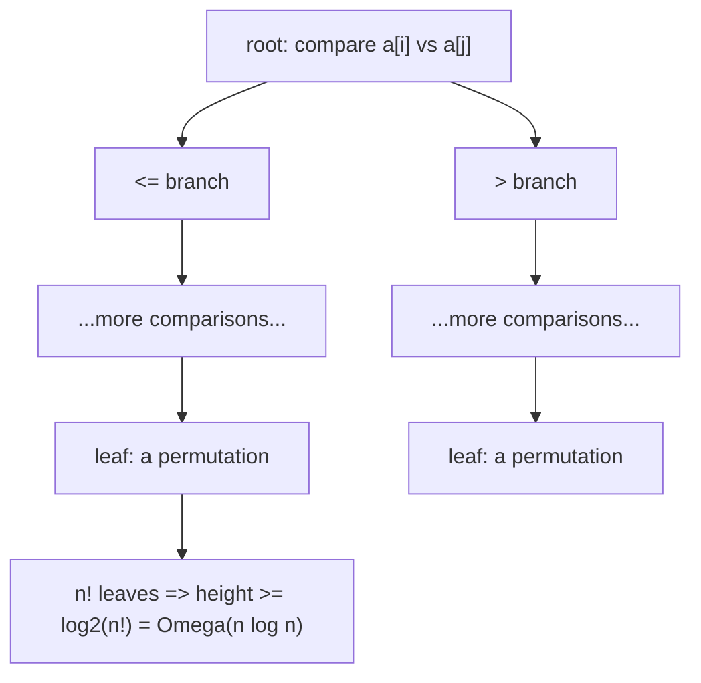

# Comparison Sorting & Its Lower Bound

*(한국어: [비교 정렬과 그 하한 (Comparison Sorting, Lower Bound)](/portfolio/study/comparison-sorting.ko/))*

> Algorithms that order items only by comparing pairs need Omega(n log n) comparisons in the worst case.

## Idea
A **comparison sort** decides the order using only $\le,\ge$ tests between elements
(insertion sort, merge sort, heapsort, quicksort). Model the run as a **decision tree**: each
internal node is a comparison, each leaf a final permutation.

## Why it matters
Establishes a hard limit: no comparison sort can beat $\Theta(n\log n)$ — so merge/heap sort
are asymptotically optimal in this model, and beating it requires *not* comparing (see linear
sorting).

## Details
There are $n!$ possible orderings, so the tree needs $n!$ leaves; a binary tree with $n!$
leaves has height $\ge\log_2(n!)=\Theta(n\log n)$ (by Stirling). Height = worst-case
comparisons.

## Diagram

## Related
[Merge Sort](/portfolio/study/merge-sort/) · [Linear-Time Sorting (Counting & Radix)](/portfolio/study/linear-sorting/) · [Asymptotic Notation (Big-O)](/portfolio/study/asymptotic-notation/)
