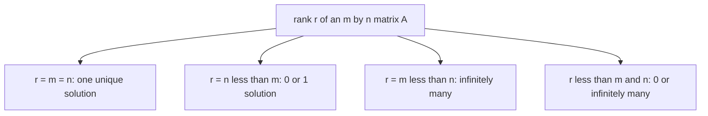

# Ax = b의 완전해 (Complete Solution)

*(English: [Complete Solution of Ax = b](/portfolio/study/complete-solution-ax-b/))*

> 모든 해는 x_특수 + x_영공간. b∈C(A)일 때 풀리며, 랭크가 해의 개수를 결정한다.

## 개념
$Ax=b$ 가 일관(consistent)이면($b\in C(A)$), 전체 해집합은
$$
x = x_p + x_n,\qquad x_n \in N(A),
$$
하나의 **특수해(particular solution)** 더하기 [영공간](/portfolio/study/nullspace.ko/) 전체다. 기하적으로는
영공간을 원점에서 평행이동한 것(아핀 부분공간)이다.

## 왜 중요한가
$m\times n$ 행렬의 [랭크](/portfolio/study/rank.ko/) $r$ 로 존재성과 유일성을 통합한다:
- $r=m=n$: 유일해(가역).
- $r=n<m$: 해 0개 또는 1개.
- $r=m<n$: 항상 풀리고 무한히 많음.
- $r<m,\,r<n$: 0개 또는 무한개.

## 다이어그램

## 관련
[영공간 N(A) (Nullspace)](/portfolio/study/nullspace.ko/) · [열공간 C(A) (Column Space)](/portfolio/study/column-space.ko/) · [랭크 (Rank)](/portfolio/study/rank.ko/)
