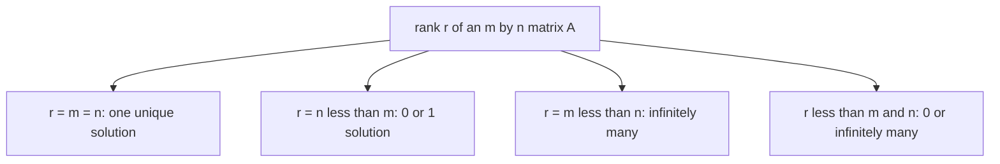

# Complete Solution of Ax = b

*(한국어: [Ax = b의 완전해 (Complete Solution)](/portfolio/study/complete-solution-ax-b.ko/))*

> Every solution is x_particular + x_nullspace; solvable iff b∈C(A); the rank decides how many solutions.

## Idea
If $Ax=b$ is consistent ($b\in C(A)$), the full solution set is
$$
x = x_p + x_n,\qquad x_n \in N(A),
$$
one **particular solution** plus the whole [Nullspace N(A)](/portfolio/study/nullspace/). Geometrically it is the nullspace
shifted off the origin (an affine subspace).

## Why it matters
It unifies existence and uniqueness through the [Rank](/portfolio/study/rank/) $r$ of an $m\times n$ matrix:
- $r=m=n$: unique solution (invertible).
- $r=n<m$: 0 or 1 solution.
- $r=m<n$: always solvable, infinitely many.
- $r<m,\,r<n$: 0 or $\infty$ solutions.

## Diagram

## Related
[Nullspace N(A)](/portfolio/study/nullspace/) · [Column Space C(A)](/portfolio/study/column-space/) · [Rank](/portfolio/study/rank/)
