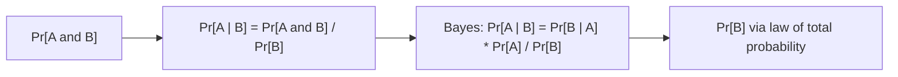

# 조건부 확률과 베이즈 정리 (Conditional Probability, Bayes)

*(English: [Conditional Probability & Bayes' Theorem](/portfolio/study/conditional-probability-and-bayes/))*

> 조건화는 정보가 주어졌을 때 확률을 갱신하고, 베이즈 정리는 조건의 방향을 뒤집는다.

## 개념
$\Pr[A\mid B]=\dfrac{\Pr[A\cap B]}{\Pr[B]}$. **전확률 법칙(law of total probability)** 은
분할에 대해 합한다: $\Pr[A]=\sum_i\Pr[A\mid B_i]\Pr[B_i]$. **베이즈:**
$\Pr[A\mid B]=\dfrac{\Pr[B\mid A]\,\Pr[A]}{\Pr[B]}$.

## 왜 중요한가
추론의 엔진이다: 의료 검사, 스팸 필터, 진단 모두 "원인이 주어졌을 때 증거 확률"을 "증거가
주어졌을 때 원인 확률"로 뒤집는다.

## 세부
유명한 함정: 희귀병에 정확한 검사라도 거짓양성이 많이 나온다. $\Pr[\text{병}\mid +]$ 이
**기저율(base rate)** $\Pr[\text{병}]$ 에 의존하기 때문이다. 트리 다이어그램이 4단계 계산을
구체화한다.

## 다이어그램

## 관련
[확률 기초: 표본공간과 4단계 방법](/portfolio/study/probability-basics.ko/) · [독립성 (Independence)](/portfolio/study/independence.ko/) · [확률변수와 분포 (Random Variables, Distributions)](/portfolio/study/random-variables.ko/)
