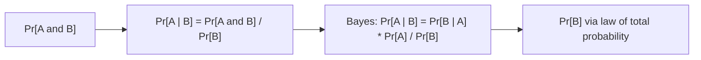

# Conditional Probability & Bayes' Theorem

*(한국어: [조건부 확률과 베이즈 정리 (Conditional Probability, Bayes)](/portfolio/study/conditional-probability-and-bayes.ko/))*

> Conditioning updates probability given information; Bayes reverses the conditioning direction.

## Idea
$\Pr[A\mid B]=\dfrac{\Pr[A\cap B]}{\Pr[B]}$. The **law of total probability** sums over a
partition: $\Pr[A]=\sum_i\Pr[A\mid B_i]\Pr[B_i]$. **Bayes:**
$\Pr[A\mid B]=\dfrac{\Pr[B\mid A]\,\Pr[A]}{\Pr[B]}$.

## Why it matters
The engine of inference: medical tests, spam filters, and diagnosis all flip "probability of
evidence given cause" into "probability of cause given evidence".

## Details
The famous trap: a rare disease with an accurate test still yields many false positives,
because $\Pr[\text{disease}\mid +]$ depends on the **base rate** $\Pr[\text{disease}]$. Tree
diagrams make the four-step computation concrete.

## Diagram

## Related
[Probability: Sample Spaces & the Four-Step Method](/portfolio/study/probability-basics/) · [Independence](/portfolio/study/independence/) · [Random Variables & Distributions](/portfolio/study/random-variables/)
