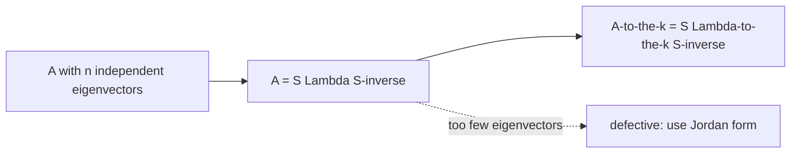

# 대각화와 거듭제곱 (Diagonalization & Powers)

*(English: [Diagonalization & Powers of A](/portfolio/study/diagonalization/))*

> A가 독립인 고유벡터 n개를 가지면 A = SΛS^{-1}, 따라서 A^k = SΛ^kS^{-1}.

## 개념
고유벡터를 $S$ 의 열에, 고유값을 $\Lambda$ 의 대각에 놓는다. 고유벡터가 독립이면($S$ 가역),
$$
A = S\Lambda S^{-1},\qquad A^k = S\Lambda^k S^{-1}.
$$

## 왜 중요한가
$A$ 의 거듭제곱·함수가 스칼라의 거듭제곱·함수가 된다 — 장기 거동(어느 $\lambda$ 가
지배하는지), 마르코프 정상상태, 차분방정식의 핵심이다.

## 세부
- 대각화 가능 $\iff$ 독립 고유벡터가 충분. 중복 고유값에 고유벡터가 부족하면
  **결손(defective)** → [조르당 형](/portfolio/study/jordan-form.ko/)을 써야 함.
- 서로 다른 고유값 $n$ 개 ⇒ 자동으로 대각화 가능.
- $u_{k+1}=Au_k$ 면 $u_k=A^ku_0=S\Lambda^kS^{-1}u_0$.

## 다이어그램

## 관련
[고유값과 고유벡터 (Eigenvalues & Eigenvectors)](/portfolio/study/eigenvalues-eigenvectors.ko/) · [행렬 지수와 미분방정식 (Matrix Exponential)](/portfolio/study/matrix-exponential.ko/) · [닮은 행렬과 조르당 형 (Jordan Form)](/portfolio/study/jordan-form.ko/)
