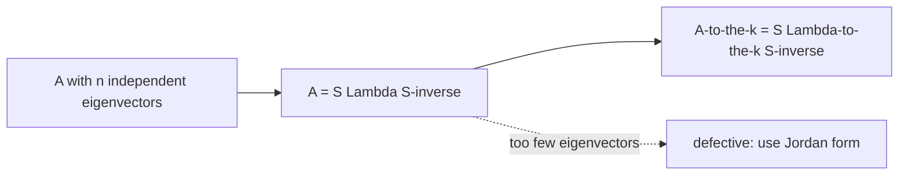

# Diagonalization & Powers of A

*(한국어: [대각화와 거듭제곱 (Diagonalization & Powers)](/portfolio/study/diagonalization.ko/))*

> If A has n independent eigenvectors, A = SΛS^{-1}, so A^k = SΛ^kS^{-1}.

## Idea
Put the eigenvectors in the columns of $S$ and the eigenvalues on the diagonal of
$\Lambda$. If the eigenvectors are independent ($S$ invertible),
$$
A = S\Lambda S^{-1},\qquad A^k = S\Lambda^k S^{-1}.
$$

## Why it matters
Powers and functions of $A$ become powers/functions of scalars — the key to long-run
behavior (which $\lambda$ dominates), Markov steady states, and difference equations.

## Details
- Diagonalizable $\iff$ enough independent eigenvectors. Repeated eigenvalues with too few
  eigenvectors are **defective** → use [Similar Matrices & Jordan Form](/portfolio/study/jordan-form/) instead.
- $n$ distinct eigenvalues ⇒ automatically diagonalizable.
- For $u_{k+1}=Au_k$, $u_k=A^ku_0=S\Lambda^kS^{-1}u_0$.

## Diagram

## Related
[Eigenvalues & Eigenvectors](/portfolio/study/eigenvalues-eigenvectors/) · [Matrix Exponential & Differential Equations](/portfolio/study/matrix-exponential/) · [Similar Matrices & Jordan Form](/portfolio/study/jordan-form/)
