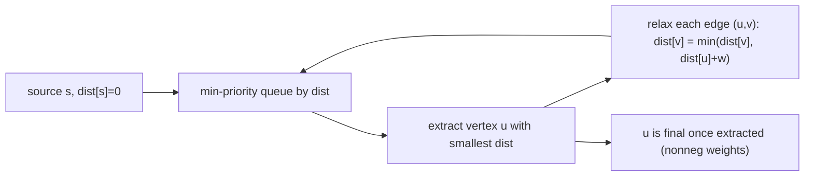

# 다익스트라 알고리즘 (Dijkstra's Algorithm)

*(English: [Dijkstra's Algorithm](/portfolio/study/dijkstra/))*

> 우선순위 큐로 가장 가까운 미확정 정점을 탐욕적으로 확정; 음이 아닌 가중치에 O(E + V log V).

## 개념
잠정 거리를 **최소 우선순위 큐** 에 둔다. 가장 가까운 미확정 정점 $u$ 를 반복 추출하고(그
거리는 이제 확정), 나가는 간선을 완화한다. 각 정점은 한 번 확정된다.

## 왜 중요한가
흔한 경우인 **음이 아닌 가중치** 의 빠른 최단 경로 알고리즘이다 — 도로망·라우팅·지도. 탐욕
구조를 이용해 Bellman-Ford 보다 빠르다.

## 세부
이진 힙으로 $O((V+E)\log V)$; 피보나치 힙으로 $O(E+V\log V)$. 정당성에 **음이 아닌** 가중치가
필요하다 — 확정된 정점은 나중에 개선될 수 없다. 음수 간선엔 실패(Bellman-Ford 사용).

## 다이어그램

## 관련
[벨만–포드 알고리즘 (Bellman–Ford)](/portfolio/study/bellman-ford.ko/) · [이진 힙과 우선순위 큐 (Binary Heaps, Priority Queues)](/portfolio/study/binary-heap.ko/) · [존슨 알고리즘 (Johnson's Algorithm)](/portfolio/study/johnsons-algorithm.ko/)
