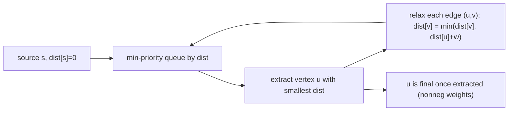

# Dijkstra's Algorithm

*(한국어: [다익스트라 알고리즘 (Dijkstra's Algorithm)](/portfolio/study/dijkstra.ko/))*

> Greedily settle the nearest unsettled vertex using a priority queue; O(E + V log V) for nonnegative weights.

## Idea
Keep tentative distances in a **min-priority queue**. Repeatedly extract the closest unsettled
vertex $u$ (its distance is now final), and relax its outgoing edges. Each vertex is settled
once.

## Why it matters
The fast shortest-path algorithm for the common case of **nonnegative weights** — road
networks, routing, maps. Faster than Bellman-Ford by exploiting the greedy structure.

## Details
With a binary heap, $O((V+E)\log V)$; with a Fibonacci heap, $O(E+V\log V)$. Correctness needs
**nonnegative** weights — a settled vertex can never be improved later. Fails with negative
edges (use Bellman-Ford).

## Diagram

## Related
[Bellman–Ford Algorithm](/portfolio/study/bellman-ford/) · [Binary Heaps & Priority Queues](/portfolio/study/binary-heap/) · [Johnson's Algorithm](/portfolio/study/johnsons-algorithm/)
