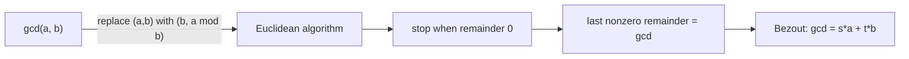

# 나누어떨어짐·최대공약수·유클리드 호제법

*(English: [Divisibility, GCD & the Euclidean Algorithm](/portfolio/study/divisibility-and-gcd/))*

> 두 정수의 최대공약수는 나머지 반복(유클리드)으로 구하고, 두 수의 정수결합으로 표현된다(베주).

## 개념
$a\mid b$ 는 어떤 정수 $k$ 에 대해 $b=ka$ 라는 뜻. **유클리드 호제법** 은
$\gcd(a,b)=\gcd(b,\,a\bmod b)$ 를 나머지가 $0$ 이 될 때까지 반복하며, 마지막 0 이 아닌
나머지가 gcd 다.

## 왜 중요한가
gcd 계산은 빠르고(입력의 로그 시간) **베주 항등식(Bezout)** $\gcd(a,b)=sa+tb$ 가 모듈러
역원을 주어 RSA 와 선형 합동식 풀이를 떠받친다.

## 세부
**확장(extended)** 유클리드 호제법은 계수 $s,t$ 를 추적한다. 소수로의 유일 분해(산술의
기본정리)가 이 도구들로부터 따라나온다.

## 다이어그램

## 관련
[모듈러 산술 (Modular Arithmetic)](/portfolio/study/modular-arithmetic.ko/) · [RSA 공개키 암호 (RSA Public-Key Cryptography)](/portfolio/study/rsa-cryptosystem.ko/) · [정렬 원리 (Well-Ordering Principle)](/portfolio/study/well-ordering-principle.ko/)
