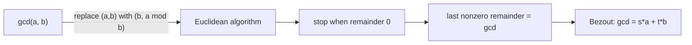

# Divisibility, GCD & the Euclidean Algorithm

*(한국어: [나누어떨어짐·최대공약수·유클리드 호제법](/portfolio/study/divisibility-and-gcd.ko/))*

> The gcd of two integers is computed by repeated remainders (Euclid), and is an integer combination of them (Bezout).

## Idea
$a\mid b$ means $b=ka$ for some integer $k$. The **Euclidean algorithm** uses
$\gcd(a,b)=\gcd(b,\,a\bmod b)$ repeatedly until the remainder is $0$; the last nonzero
remainder is the gcd.

## Why it matters
gcd computation is fast (logarithmic in the inputs) and **Bezout's identity**
$\gcd(a,b)=sa+tb$ gives modular inverses, which power RSA and solving linear congruences.

## Details
The **extended** Euclidean algorithm tracks the coefficients $s,t$. Unique factorization
into primes (the Fundamental Theorem of Arithmetic) follows from these tools.

## Diagram

## Related
[Modular Arithmetic](/portfolio/study/modular-arithmetic/) · [RSA Public-Key Cryptography](/portfolio/study/rsa-cryptosystem/) · [Well-Ordering Principle](/portfolio/study/well-ordering-principle/)
