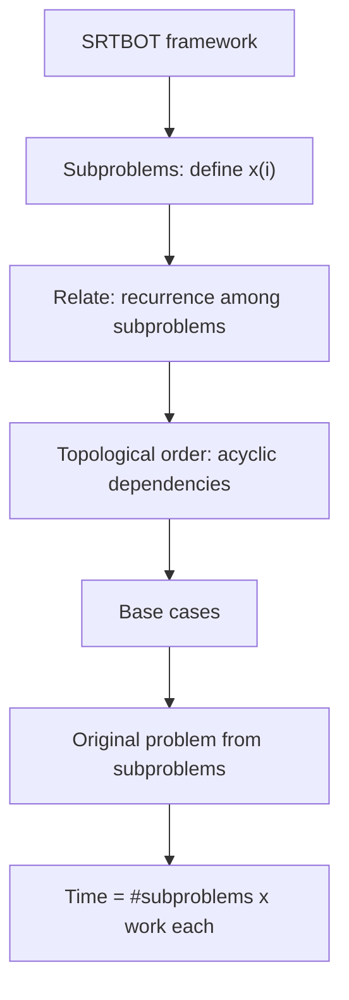

# 동적 계획법 (SRTBOT) (Dynamic Programming)

*(English: [Dynamic Programming (SRTBOT)](/portfolio/study/dynamic-programming/))*

> 겹치는 부분문제를 점화식으로 연결하고 위상 순서로 한 번씩 평가해 문제를 푼다.

## 개념
동적 계획법 = **겹치는 부분문제** 에 대한 재귀 + 메모이제이션. 6.006 의 **SRTBOT** 레시피:
**S**ubproblems(부분문제), **R**elate(점화식 연결), **T**opological order(비순환 위상 순서),
**B**ase cases(기저), **O**riginal(원문제), **T**ime(시간). 각 부분문제는 한 번 풀려 재사용된다.

## 왜 중요한가
부분문제가 반복될 때 지수 완전탐색을 다항 시간으로 바꾼다 — 최적화와 셈을 위한 가장 강력한
알고리즘 설계 기법.

## 세부
실행시간 $=$ (부분문제 수) $\times$ (부분문제당 작업). 예: 피보나치, 최장 공통 부분수열,
최장 증가 부분수열, 편집 거리, 동전 거스름. 부분문제 의존 그래프가 DAG 인 DAG 완화다.

## 다이어그램

## 관련
[유사다항 시간과 부분집합 합 (Pseudopolynomial, Subset Sum)](/portfolio/study/pseudopolynomial.ko/) · [분할정복 점화식과 마스터 정리](/portfolio/study/divide-and-conquer-recurrences.ko/) · [DAG 최단 경로 (완화) (DAG Relaxation)](/portfolio/study/dag-relaxation.ko/)
