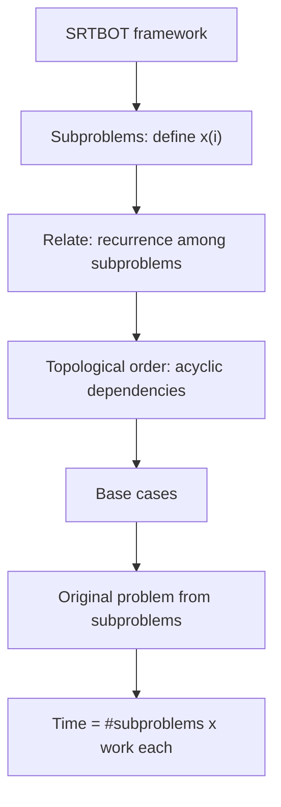

# Dynamic Programming (SRTBOT)

*(한국어: [동적 계획법 (SRTBOT) (Dynamic Programming)](/portfolio/study/dynamic-programming.ko/))*

> Solve a problem via overlapping subproblems related by a recurrence, evaluated once each in topological order.

## Idea
Dynamic programming = recursion + memoization on **overlapping subproblems**. The 6.006
**SRTBOT** recipe: **S**ubproblems, **R**elate by a recurrence, **T**opological order (acyclic),
**B**ase cases, **O**riginal problem, **T**ime. Each subproblem is solved once and reused.

## Why it matters
Turns exponential brute force into polynomial time whenever subproblems repeat — the single
most powerful algorithm-design technique for optimization and counting.

## Details
Running time $=$ (number of subproblems) $\times$ (work per subproblem). Examples: Fibonacci,
longest common subsequence, longest increasing subsequence, edit distance, coin change. It is
DAG relaxation where the DAG is the subproblem-dependency graph.

## Diagram

## Related
[Pseudopolynomial Time & Subset Sum](/portfolio/study/pseudopolynomial/) · [Divide-and-Conquer Recurrences & Master Theorem](/portfolio/study/divide-and-conquer-recurrences/) · [DAG Shortest Paths (Relaxation)](/portfolio/study/dag-relaxation/)
