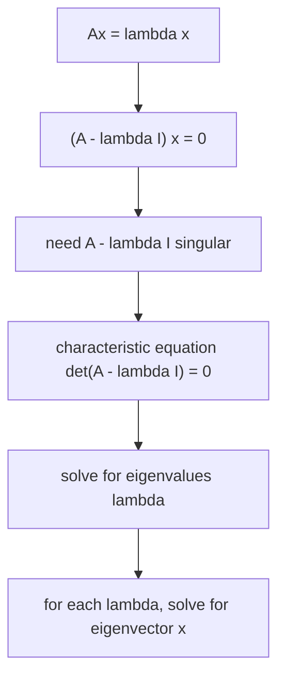

고유값과 고유벡터 (Eigenvalues & Eigenvectors)

*(English: [Eigenvalues & Eigenvectors](/portfolio/study/eigenvalues-eigenvectors/))*

> A가 크기만 바꾸는 방향 x: Ax=λx. det(A−λI)=0에서 구한다.

## 개념
**고유벡터(eigenvector)** $x\ne 0$ 은 $A$ 아래서 방향을 유지하고 **고유값(eigenvalue)**
$\lambda$ 만큼만 늘어난다:
$$
Ax = \lambda x \iff (A-\lambda I)x = 0.
$$
0이 아닌 $x$ 는 $A-\lambda I$ 가 비가역일 때 정확히 존재한다. 즉 **특성방정식**
$\det(A-\lambda I)=0$ 이 성립할 때다.

## 왜 중요한가
고유분해는 $A$ 의 작용을 드러낸다: 문제를 독립적인 1차원 스케일링으로 분리해 거듭제곱
$A^k$, 미분방정식, 안정성을 쉽게 만든다([대각화와 거듭제곱 (Diagonalization & Powers)](/portfolio/study/diagonalization.ko/), [행렬 지수와 미분방정식 (Matrix Exponential)](/portfolio/study/matrix-exponential.ko/) 참고).

## 세부
- 고유값의 합 = **대각합(trace)**, 곱 = $\det A$.
- $\lambda$ 들은 차수 $n$ 다항식의 해다(복소·중복 가능).
- 특별한 행렬은 특별한 스펙트럼을 가진다: [대칭](/portfolio/study/symmetric-matrix.ko/)(실수 $\lambda$, 직교
  고유벡터), [마르코프](/portfolio/study/markov-matrix.ko/)($\lambda=1$ 존재).

## 다이어그램

## 관련
[대각화와 거듭제곱 (Diagonalization & Powers)](/portfolio/study/diagonalization.ko/) · [대칭 행렬과 스펙트럼 정리 (Symmetric Matrices)](/portfolio/study/symmetric-matrix.ko/) · [행렬 지수와 미분방정식 (Matrix Exponential)](/portfolio/study/matrix-exponential.ko/)
