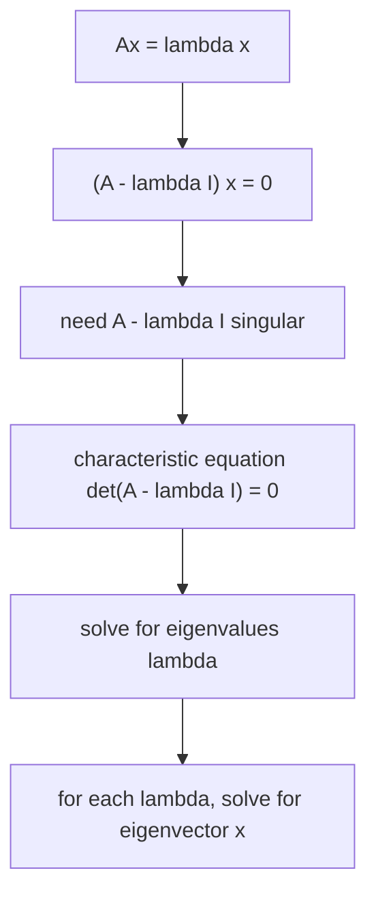

Eigenvalues & Eigenvectors

*(한국어: [고유값과 고유벡터 (Eigenvalues & Eigenvectors)](/portfolio/study/eigenvalues-eigenvectors.ko/))*

> Directions x that A only scales: Ax=λx; found from det(A−λI)=0.

## Idea
An **eigenvector** $x\ne 0$ keeps its direction under $A$, only stretched by the
**eigenvalue** $\lambda$:
$$
Ax = \lambda x \iff (A-\lambda I)x = 0.
$$
A nonzero $x$ exists exactly when $A-\lambda I$ is singular, i.e. the
**characteristic equation** $\det(A-\lambda I)=0$ holds.

## Why it matters
Eigen-decomposition reveals how $A$ acts: it decouples the problem into independent
1-D scalings, which makes powers $A^k$, differential equations, and stability easy
(see [Diagonalization & Powers of A](/portfolio/study/diagonalization/), [Matrix Exponential & Differential Equations](/portfolio/study/matrix-exponential/)).

## Details
- Sum of eigenvalues = **trace**; product = $\det A$.
- The $\lambda$'s solve a degree-$n$ polynomial (may be complex or repeated).
- Special matrices have special spectra: [Symmetric Matrices & the Spectral Theorem](/portfolio/study/symmetric-matrix/) (real $\lambda$, orthogonal
  eigenvectors), [Markov Matrices](/portfolio/study/markov-matrix/) ($\lambda=1$ present).

## Diagram

## Related
[Diagonalization & Powers of A](/portfolio/study/diagonalization/) · [Symmetric Matrices & the Spectral Theorem](/portfolio/study/symmetric-matrix/) · [Matrix Exponential & Differential Equations](/portfolio/study/matrix-exponential/)
