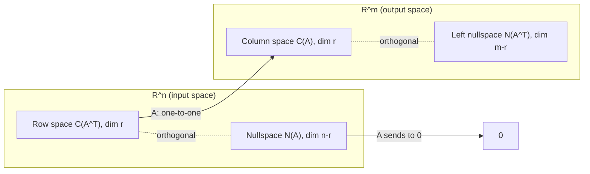

# 네 기본 부분공간 (Four Fundamental Subspaces)

*(English: [The Four Fundamental Subspaces](/portfolio/study/four-fundamental-subspaces/))*

> 모든 행렬은 C(A), N(A), C(A^T), N(A^T)를 가지며 차원은 r, n−r, r, m−r — 직교 보공간 쌍을 이룬다.

## 개념
랭크 $r$ 인 $m\times n$ 행렬에 대해:
- **열공간** $C(A)\subseteq\mathbb{R}^m$, $\dim=r$.
- **영공간** $N(A)\subseteq\mathbb{R}^n$, $\dim=n-r$.
- **행공간** $C(A^T)\subseteq\mathbb{R}^n$, $\dim=r$.
- **왼쪽 영공간** $N(A^T)\subseteq\mathbb{R}^m$, $\dim=m-r$.

## 왜 중요한가
이 과목의 "큰 그림"이다. $\mathbb{R}^n$ 에서: 행공간 $\perp$ 영공간이고 둘이
$\mathbb{R}^n$ 을 채운다($r+(n-r)=n$). $\mathbb{R}^m$ 에서: 열공간 $\perp$ 왼쪽 영공간.
즉
$$
C(A^T)\perp N(A),\qquad C(A)\perp N(A^T).
$$

## 세부
- 직교성은 정확하다(각각 서로의 [직교 보공간](/portfolio/study/orthogonality.ko/)).
- 사상 $A$ 는 행공간을 열공간으로 일대일 대응시키고, 영공간은 $0$ 으로 보낸다.

## 다이어그램

## 관련
[직교성과 직교 보공간 (Orthogonality)](/portfolio/study/orthogonality.ko/) · [랭크 (Rank)](/portfolio/study/rank.ko/) · [특이값 분해 (SVD)](/portfolio/study/singular-value-decomposition.ko/)
