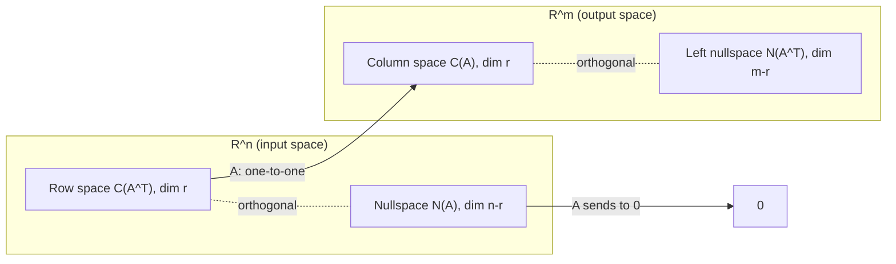

# The Four Fundamental Subspaces

*(한국어: [네 기본 부분공간 (Four Fundamental Subspaces)](/portfolio/study/four-fundamental-subspaces.ko/))*

> Every matrix has C(A), N(A), C(A^T), N(A^T) with dimensions r, n−r, r, m−r — and they pair up as orthogonal complements.

## Idea
For an $m\times n$ matrix of rank $r$:
- **Column space** $C(A)\subseteq\mathbb{R}^m$, $\dim=r$.
- **Nullspace** $N(A)\subseteq\mathbb{R}^n$, $\dim=n-r$.
- **Row space** $C(A^T)\subseteq\mathbb{R}^n$, $\dim=r$.
- **Left nullspace** $N(A^T)\subseteq\mathbb{R}^m$, $\dim=m-r$.

## Why it matters
This is the "big picture" of the course. In $\mathbb{R}^n$: row space $\perp$ nullspace,
and they fill $\mathbb{R}^n$ ($r+(n-r)=n$). In $\mathbb{R}^m$: column space $\perp$ left
nullspace. So
$$
C(A^T)\perp N(A),\qquad C(A)\perp N(A^T).
$$

## Details
- Orthogonality is exact (each is the other's [orthogonal complement](/portfolio/study/orthogonality/)).
- The map $A$ takes the row space one-to-one onto the column space; it sends the nullspace
  to $0$.

## Diagram

## Related
[Orthogonality & Orthogonal Complements](/portfolio/study/orthogonality/) · [Rank](/portfolio/study/rank/) · [Singular Value Decomposition (SVD)](/portfolio/study/singular-value-decomposition/)
