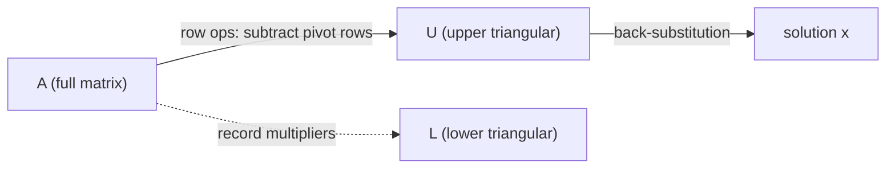

# 가우스 소거법 (Gaussian Elimination)

*(English: [Gaussian Elimination](/portfolio/study/gaussian-elimination/))*

> 행 연산으로 A를 위삼각(upper-triangular) 형태로 줄인 뒤 후진대입으로 푸는 체계적 방법.

## 개념
한 열씩 미지수를 소거한다: **피벗(pivot)** 행의 배수를 아래 행들에서 빼서 각 피벗 아래를
0으로 만들고, $A$ 를 위삼각 $U$ 로 바꾼다. 그다음 아래에서 위로 **후진대입(back-
substitution)** 한다.

$$
\begin{bmatrix} 2 & 1 \\ 6 & 8 \end{bmatrix}
\;\xrightarrow{\,R_2 - 3R_1\,}\;
\begin{bmatrix} 2 & 1 \\ 0 & 5 \end{bmatrix}
$$

## 왜 중요한가
$Ax=b$ 를 푸는 핵심 알고리즘이며 [LU 분해](/portfolio/study/lu-factorization.ko/)의 출발점이다: 소거에 쓴
배수들이 정확히 $L$ 의 성분이 된다.

## 세부
- **피벗**은 각 행의 맨 앞 0이 아닌 성분이다. 피벗이 0이면 **행 교환(row exchange)** 이
  필요하다(순열, [전치와 순열 행렬 (Transpose & Permutations)](/portfolio/study/transpose-and-permutations.ko/) 참고).
- 어떤 열에 유효한 피벗이 없으면 그 변수는 **자유변수(free variable)** 가 된다
  ([Ax = 0 풀기: 피벗·자유변수·RREF](/portfolio/study/solving-ax-0.ko/) 참고). 피벗 개수가 [랭크](/portfolio/study/rank.ko/)다.
- 각 소거 단계는 기본행렬(elementary matrix) $E_{ij}$ 를 왼쪽에 곱하는 것이다.

## 다이어그램

## 관련
[LU 분해 (LU Factorization)](/portfolio/study/lu-factorization.ko/) · [역행렬 (Matrix Inverse)](/portfolio/study/matrix-inverse.ko/) · [랭크 (Rank)](/portfolio/study/rank.ko/)
