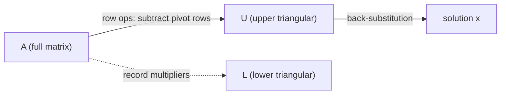

# Gaussian Elimination

*(한국어: [가우스 소거법 (Gaussian Elimination)](/portfolio/study/gaussian-elimination.ko/))*

> Systematic row operations that reduce A to upper-triangular form, then solve by back-substitution.

## Idea
Eliminate unknowns one column at a time: subtract multiples of the **pivot** row from rows
below to zero out the entries under each pivot, turning $A$ into an upper-triangular $U$.
Then **back-substitute** from the bottom up.

$$
\begin{bmatrix} 2 & 1 \\ 6 & 8 \end{bmatrix}
\;\xrightarrow{\,R_2 - 3R_1\,}\;
\begin{bmatrix} 2 & 1 \\ 0 & 5 \end{bmatrix}
$$

## Why it matters
It is the workhorse algorithm for solving $Ax=b$ and the source of the
[LU Factorization](/portfolio/study/lu-factorization/): the multipliers used in elimination are exactly the entries of $L$.

## Details
- **Pivots** are the leading nonzero entries; a zero pivot needs a **row exchange**
  (a permutation, see [Transpose & Permutation Matrices](/portfolio/study/transpose-and-permutations/)).
- No valid pivot in a column ⇒ that variable is **free** (see [Solving Ax = 0: Pivots, Free Variables, RREF](/portfolio/study/solving-ax-0/)); the count
  of pivots is the [Rank](/portfolio/study/rank/).
- Each elimination step is left-multiplication by an elementary matrix $E_{ij}$.

## Diagram

## Related
[LU Factorization](/portfolio/study/lu-factorization/) · [Matrix Inverse](/portfolio/study/matrix-inverse/) · [Rank](/portfolio/study/rank/)
