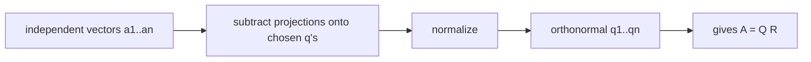

# 그람–슈미트 직교화 (Gram–Schmidt)

*(English: [Gram–Schmidt Orthogonalization](/portfolio/study/gram-schmidt/))*

> 사영을 빼가며 독립 집합을 한 벡터씩 정규직교 집합으로 바꾸는 절차.

## 개념
독립인 $a_1,\dots,a_n$ 이 주어지면 정규직교 $q_1,\dots,q_n$ 을 만든다: 각 $a_k$ 에서 이미
고른 $q$ 들로의 **사영을 빼고** 정규화한다.
$$
q_k = \frac{a_k - \sum_{j<k}(q_j^Ta_k)q_j}{\| \cdot \|}.
$$

## 왜 중요한가
정규직교 기저는 모든 걸 쉽게 만든다: 사영이 내적이 되고 역행렬이 필요 없다. 그람–슈미트는
[QR 분해](/portfolio/study/qr-factorization.ko/) $A=QR$ 의 바탕 구성이다.

## 세부
- $q$ 들은 매 단계에서 $a$ 들과 같은 공간을 생성한다.
- 계수 $q_j^Ta_k$ 가 위삼각 $R$ 이 된다.
- 수치적으로는 "수정(modified)" 그람–슈미트가 고전 버전보다 안정적이다.

## 다이어그램

## 관련
[QR 분해 (QR Factorization)](/portfolio/study/qr-factorization.ko/) · [직교 행렬 (Orthogonal Matrix)](/portfolio/study/orthogonal-matrix.ko/) · [부분공간으로의 사영 (Projection)](/portfolio/study/projection.ko/)
