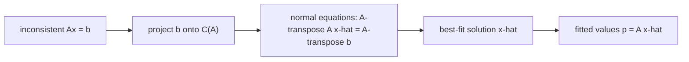

# 최소제곱 (Least Squares)

*(English: [Least Squares](/portfolio/study/least-squares/))*

> 모순된 Ax=b의 최적 근사해. 정규방정식 A^TA x̂ = A^Tb로 구한다.

## 개념
$Ax=b$ 에 해가 **없을** 때(식이 미지수보다 많고 $b\notin C(A)$), $\|Ax-b\|^2$ 을 최소화하는
$\hat x$ 를 찾는다. 그 최소해는 $b$ 를 $C(A)$ 로 사영하며 **정규방정식(normal equations)** 을
푼다:
$$
A^TA\,\hat x = A^Tb.
$$

## 왜 중요한가
데이터 적합/회귀(예: 잡음 섞인 점들에 최적 직선)의 핵심이다. [사영](/portfolio/study/projection.ko/)을
알고리즘으로 바꾼 것이다.

## 세부
- $A$ 의 열이 독립이면 $A^TA$ 는 가역(대칭 양의정부호)이고
  $\hat x = (A^TA)^{-1}A^Tb$.
- 수치적으로는 $A^TA$ 를 만들지 말고 [QR](/portfolio/study/qr-factorization.ko/)로 풀어라($R\hat x = Q^Tb$).
  $A^TA$ 는 조건수(condition number)를 제곱시킨다.
- 적합값은 $p=A\hat x = Pb$.

## 다이어그램

## 관련
[부분공간으로의 사영 (Projection)](/portfolio/study/projection.ko/) · [QR 분해 (QR Factorization)](/portfolio/study/qr-factorization.ko/) · [유사역행렬 (Pseudoinverse)](/portfolio/study/pseudoinverse.ko/)
