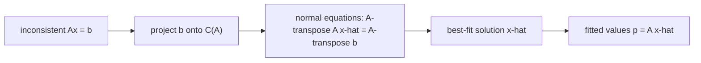

# Least Squares

*(한국어: [최소제곱 (Least Squares)](/portfolio/study/least-squares.ko/))*

> Best-fit solution to an inconsistent Ax=b, found from the normal equations A^TA x̂ = A^Tb.

## Idea
When $Ax=b$ has **no** solution (more equations than unknowns, $b\notin C(A)$), find
$\hat x$ minimizing $\|Ax-b\|^2$. The minimizer projects $b$ onto $C(A)$ and solves the
**normal equations**:
$$
A^TA\,\hat x = A^Tb.
$$

## Why it matters
This is the workhorse of data fitting / regression (e.g. best straight line through noisy
points). It is [Projection onto a Subspace](/portfolio/study/projection/) turned into an algorithm.

## Details
- If $A$ has independent columns, $A^TA$ is invertible (symmetric positive definite) and
  $\hat x = (A^TA)^{-1}A^Tb$.
- Numerically, solve via [QR Factorization](/portfolio/study/qr-factorization/) ($R\hat x = Q^Tb$) rather than forming
  $A^TA$, which squares the condition number.
- The fitted values are $p=A\hat x = Pb$.

## Diagram

## Related
[Projection onto a Subspace](/portfolio/study/projection/) · [QR Factorization](/portfolio/study/qr-factorization/) · [Pseudoinverse](/portfolio/study/pseudoinverse/)
