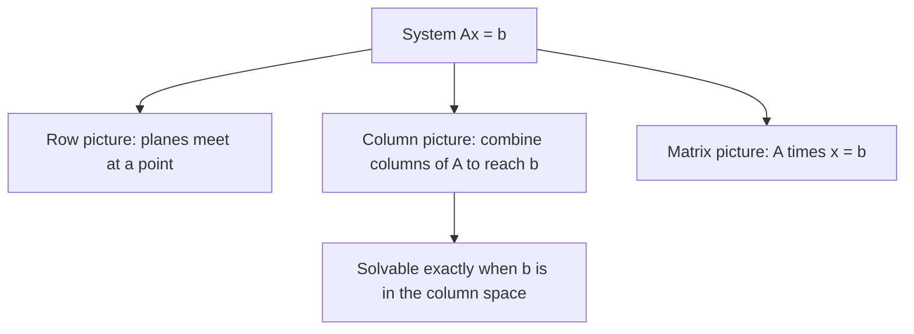

Ax = b 의 세 가지 그림 (Row/Column/Matrix Pictures)

*(English: [Three Pictures of Ax = b](/portfolio/study/linear-system-pictures/))*

> 선형 연립방정식은 세 가지 관점으로 본다: 행(평면들의 교차), 열(열벡터들의 결합), 그리고 행렬형 Ax=b.

## 개념
같은 연립방정식 $Ax=b$ 를 세 가지로 읽을 수 있다:
- **행 그림(row picture)** — 각 방정식이 직선/평면이고, 해는 그것들이 만나는 점.
- **열 그림(column picture)** — $b$ 를 $A$ 의 **열들의 선형결합(linear combination)** 으로 봄:
$$
x_1\,(\text{열}_1) + x_2\,(\text{열}_2) + \dots = b
$$
- **행렬 그림(matrix picture)** — $Ax = b$ 로 묶음.

## 왜 중요한가
Strang이 강조하는 것은 열 그림이다: $Ax=b$ 를 푸는 것은 *"$A$ 의 열들을 어떻게 결합하면
$b$ 가 되는가?"* 를 묻는 것이다. 이 재해석이 곧바로 [열공간](/portfolio/study/column-space.ko/)과 전체 부분공간
이론으로 이어진다. 해는 정확히 $b$ 가 열공간 안에 있을 때 존재한다.

## 세부
미지수 2개·식 2개면 행 그림은 두 직선이 한 점에서 만나는 것, 열 그림은 두 벡터를 결합해
$b$ 에 도달하는 것이다. 차원이 올라가면 행은 초평면이 되지만, 열 관점은 $n$ 차원으로 깔끔히
확장된다.

## 다이어그램

## 관련
[열공간 C(A) (Column Space)](/portfolio/study/column-space.ko/) · [가우스 소거법 (Gaussian Elimination)](/portfolio/study/gaussian-elimination.ko/) · [행렬 곱셈 (Matrix Multiplication)](/portfolio/study/matrix-multiplication.ko/)
