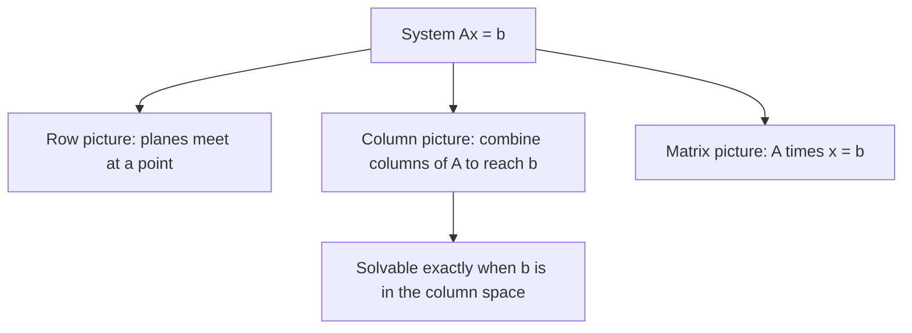

Three Pictures of Ax = b

*(한국어: [Ax = b 의 세 가지 그림 (Row/Column/Matrix Pictures)](/portfolio/study/linear-system-pictures.ko/))*

> A linear system has three views: rows (intersecting planes), columns (combination of column vectors), and the matrix form Ax=b.

## Idea
The same system $Ax=b$ can be read three ways:
- **Row picture** — each equation is a line/plane; the solution is where they intersect.
- **Column picture** — $b$ as a **linear combination of the columns** of $A$:
$$
x_1\,(\text{col}_1) + x_2\,(\text{col}_2) + \dots = b
$$
- **Matrix picture** — package it as $Ax = b$.

## Why it matters
The column picture is the one Strang stresses: solving $Ax=b$ asks *"which combination of
$A$'s columns gives $b$?"* This reframing leads directly to the [Column Space C(A)](/portfolio/study/column-space/) and the
whole subspace theory. A solution exists exactly when $b$ lies in the column space.

## Details
For 2 equations in 2 unknowns the row picture is two lines meeting at a point; the column
picture is two vectors combined to reach $b$. In higher dimensions rows become hyperplanes,
but the column view scales cleanly to $n$ dimensions.

## Diagram

## Related
[Column Space C(A)](/portfolio/study/column-space/) · [Gaussian Elimination](/portfolio/study/gaussian-elimination/) · [Matrix Multiplication](/portfolio/study/matrix-multiplication/)
