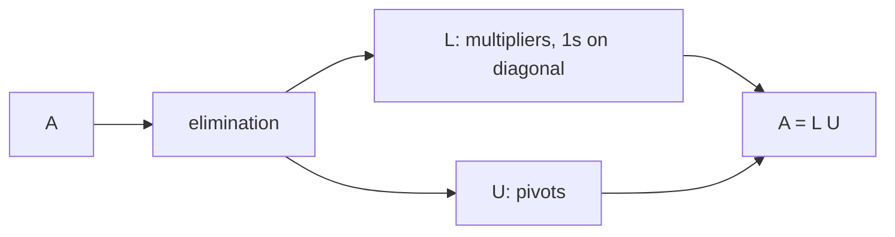

LU 분해 (LU Factorization)

*(English: [LU Factorization](/portfolio/study/lu-factorization/))*

> 소거를 A = LU로 쓴 것: 아래삼각 L(배수들) 곱하기 위삼각 U(피벗들).

## 개념
[가우스 소거](/portfolio/study/gaussian-elimination.ko/)가 $A$ 를 위삼각 $U$ 로 바꾼다. 사용한 배수들을
(부호 포함) 대각이 1인 아래삼각 $L$ 에 기록하면
$$
A = LU = \begin{bmatrix} 1 & 0 \\ 3 & 1 \end{bmatrix}
        \begin{bmatrix} 2 & 1 \\ 0 & 5 \end{bmatrix}.
$$

## 왜 중요한가
Strang의 "위대한 분해" 중 첫 번째. 우변이 **여러 개**인 $Ax=b$ 를 효율적으로 푸는
방법이다: 한 번 분해한 뒤 $Ly=b$, $Ux=y$ 를 대입으로 푼다.

## 세부
- 분해 비용 $\approx \tfrac{1}{3}n^3$, 각 풀이는 $O(n^2)$.
- 행 교환이 필요하면 순열 $P$ 가 붙어 $PA = LU$ 가 된다
  ([전치와 순열 행렬 (Transpose & Permutations)](/portfolio/study/transpose-and-permutations.ko/) 참고).
- $L$ 은 소거 배수 그 자체라 따로 구할 일이 없다.

## 다이어그램

## 관련
[가우스 소거법 (Gaussian Elimination)](/portfolio/study/gaussian-elimination.ko/) · [전치와 순열 행렬 (Transpose & Permutations)](/portfolio/study/transpose-and-permutations.ko/) · [QR 분해 (QR Factorization)](/portfolio/study/qr-factorization.ko/)
