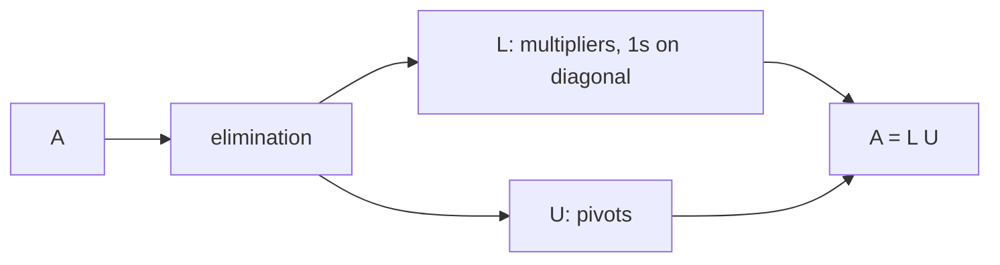

LU Factorization

*(한국어: [LU 분해 (LU Factorization)](/portfolio/study/lu-factorization.ko/))*

> Elimination written as A = LU: lower-triangular L (multipliers) times upper-triangular U (pivots).

## Idea
[Gaussian Elimination](/portfolio/study/gaussian-elimination/) turns $A$ into upper-triangular $U$. Recording the multipliers
(with signs) in a lower-triangular $L$ (with 1's on the diagonal) gives
$$
A = LU = \begin{bmatrix} 1 & 0 \\ 3 & 1 \end{bmatrix}
        \begin{bmatrix} 2 & 1 \\ 0 & 5 \end{bmatrix}.
$$

## Why it matters
First of Strang's "great factorizations." It is the efficient way to solve $Ax=b$ for
**many** right-hand sides: factor once, then solve $Ly=b$ and $Ux=y$ by substitution.

## Details
- Cost $\approx \tfrac{1}{3}n^3$ for the factorization; each solve is $O(n^2)$.
- If a row exchange is needed, you get $PA = LU$ with a permutation $P$
  (see [Transpose & Permutation Matrices](/portfolio/study/transpose-and-permutations/)).
- $L$ holds exactly the elimination multipliers — no extra work to find it.

## Diagram

## Related
[Gaussian Elimination](/portfolio/study/gaussian-elimination/) · [Transpose & Permutation Matrices](/portfolio/study/transpose-and-permutations/) · [QR Factorization](/portfolio/study/qr-factorization/)
