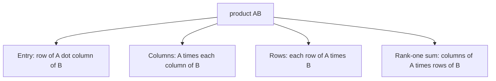

행렬 곱셈 (Matrix Multiplication)

*(English: [Matrix Multiplication](/portfolio/study/matrix-multiplication/))*

> 곱 AB를 네 가지 동등한 방식으로 이해한다: 성분 내적, 열, 행, 그리고 rank-1 조각들의 합.

## 개념
$A$ ($m\times n$), $B$ ($n\times p$) 일 때 $C=AB$ 는 $m\times p$. 네 관점:
1. **성분:** $c_{ij} = (A\text{의 } i\text{행})\cdot(B\text{의 } j\text{열})$.
2. **열:** $C$ 의 각 열은 $A$ 곱하기 $B$ 의 한 열.
3. **행:** $C$ 의 각 행은 $A$ 의 한 행 곱하기 $B$.
4. **rank-1 합:** $AB = \sum_k (A\text{의 } k\text{열})(B\text{의 } k\text{행})$ —
   [rank-1 행렬](/portfolio/study/rank-one-matrix.ko/)들의 합.

## 왜 중요한가
열/행·rank-1 관점이 분해(factorization)를 설명한다: $A=LU$, $A=QR$, $A=U\Sigma V^T$ 는
모두 "$A$ 를 더 단순한 조각들로 짓는다". 곱셈은 **결합법칙**은 성립하지만 **교환법칙은
안 됨**($AB\ne BA$ 일반적으로).

## 세부
- $(AB)^T = B^T A^T$ (순서가 뒤집힘, [전치와 순열 행렬 (Transpose & Permutations)](/portfolio/study/transpose-and-permutations.ko/) 참고).
- 블록 크기가 맞으면 블록 곱셈도 된다.

## 다이어그램

## 관련
[역행렬 (Matrix Inverse)](/portfolio/study/matrix-inverse.ko/) · [rank-1 행렬 (Rank-One Matrices)](/portfolio/study/rank-one-matrix.ko/) · [LU 분해 (LU Factorization)](/portfolio/study/lu-factorization.ko/)
