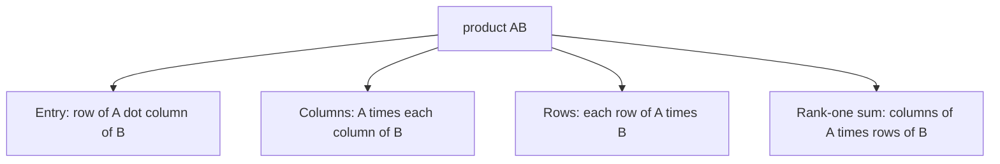

Matrix Multiplication

*(한국어: [행렬 곱셈 (Matrix Multiplication)](/portfolio/study/matrix-multiplication.ko/))*

> The product AB, understood four equivalent ways: entry dot-products, columns, rows, and a sum of rank-one pieces.

## Idea
For $A$ ($m\times n$) and $B$ ($n\times p$), $C=AB$ is $m\times p$. Four views:
1. **Entry:** $c_{ij} = (\text{row } i \text{ of } A)\cdot(\text{col } j \text{ of } B)$.
2. **Columns:** each column of $C$ is $A$ times a column of $B$.
3. **Rows:** each row of $C$ is a row of $A$ times $B$.
4. **Rank-one sum:** $AB = \sum_k (\text{col}_k A)(\text{row}_k B)$ — a sum of
   [rank-one matrices](/portfolio/study/rank-one-matrix/).

## Why it matters
The column/row and rank-one views explain factorizations: $A=LU$, $A=QR$, $A=U\Sigma V^T$
are all "build $A$ from simpler pieces." Multiplication is **associative** but **not
commutative** ($AB\ne BA$ in general).

## Details
- $(AB)^T = B^T A^T$ (order reverses; see [Transpose & Permutation Matrices](/portfolio/study/transpose-and-permutations/)).
- Block multiplication works if block sizes match.

## Diagram

## Related
[Matrix Inverse](/portfolio/study/matrix-inverse/) · [Rank-One Matrices](/portfolio/study/rank-one-matrix/) · [LU Factorization](/portfolio/study/lu-factorization/)
