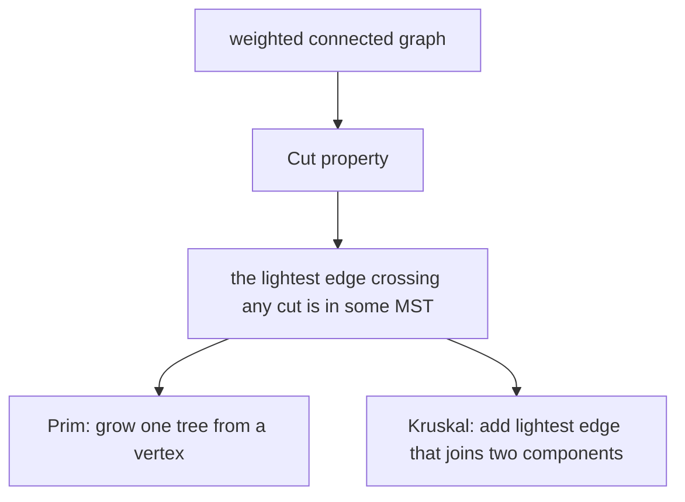

# 최소 신장 트리 (Minimum Spanning Trees)

*(English: [Minimum Spanning Trees](/portfolio/study/minimum-spanning-tree/))*

> 모든 정점을 잇는 가장 싼 간선 집합; 절단 성질 덕분에 탐욕이 통한다.

## 개념
가중 연결 그래프에서 **MST** 는 총 간선 가중치가 최소인 신장 트리다. 두 고전 알고리즘 모두
탐욕이며, **절단 성질(cut property)** 로 정당화된다: 정점을 어떻게 나누든 그 절단을 가로지르는
가장 가벼운 간선은 어떤 MST 에 속한다.

## 왜 중요한가
최소 비용 네트워크 설계(케이블, 도로, 클러스터링)를 모델링한다. 탐욕이 전역 최적을 증명 가능하게
주는 대표 예다.

## 세부
쌍대인 **순환 성질(cycle property):** 어떤 순환의 가장 무거운 간선은 어떤 MST 에도 없다. Prim 은
한 트리를 키우고, Kruskal 은 union-find 로 전역 최소 안전 간선을 더한다. 둘 다 $O(E\log V)$.

## 다이어그램

## 관련
[프림 알고리즘 (Prim's Algorithm)](/portfolio/study/prims-algorithm.ko/) · [크루스칼 알고리즘 (Kruskal's Algorithm)](/portfolio/study/kruskals-algorithm.ko/) · [트리와 신장 트리 (Trees & Spanning Trees)](/portfolio/study/trees-and-spanning-trees.ko/)
