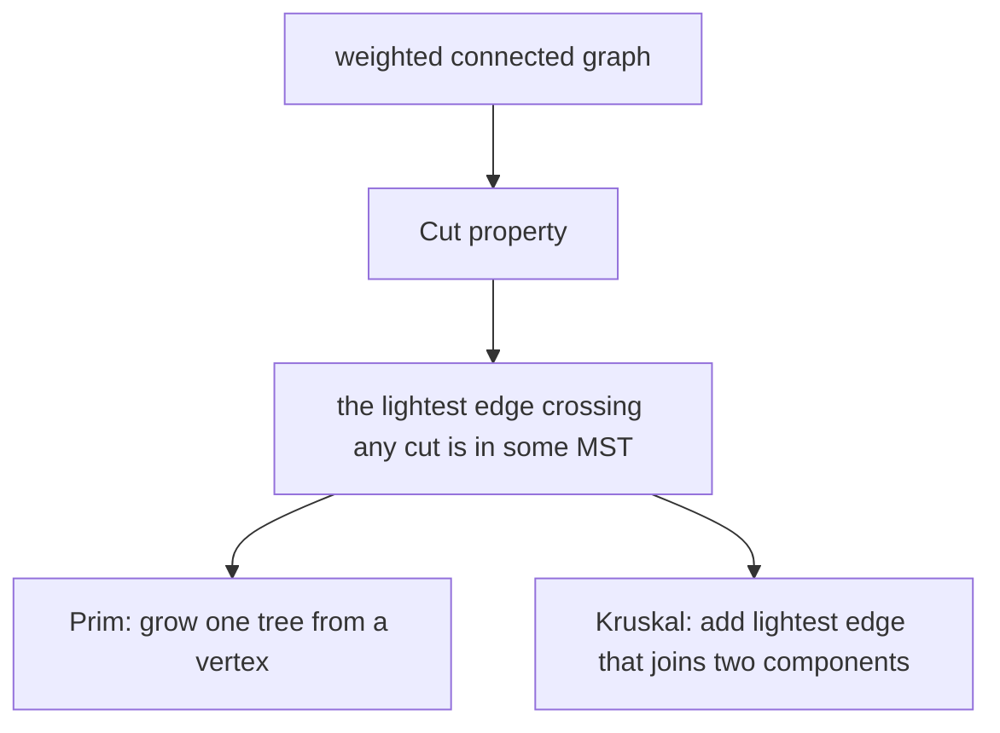

# Minimum Spanning Trees

*(한국어: [최소 신장 트리 (Minimum Spanning Trees)](/portfolio/study/minimum-spanning-tree.ko/))*

> The cheapest set of edges connecting all vertices; greedy works thanks to the cut property.

## Idea
Given a weighted connected graph, the **MST** is a spanning tree of minimum total edge weight.
Both classic algorithms are greedy, justified by the **cut property**: for any partition of the
vertices, the lightest edge crossing it belongs to some MST.

## Why it matters
Models least-cost network design (cables, roads, clustering). It's the headline example where
greedy provably yields the global optimum.

## Details
The dual **cycle property:** the heaviest edge on any cycle is in no MST. Prim grows one tree;
Kruskal adds globally-lightest safe edges using union-find. Both run in
$O(E\log V)$.

## Diagram

## Related
[Prim's Algorithm](/portfolio/study/prims-algorithm/) · [Kruskal's Algorithm](/portfolio/study/kruskals-algorithm/) · [Trees & Spanning Trees](/portfolio/study/trees-and-spanning-trees/)
