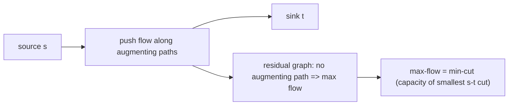

# 네트워크 흐름과 최대유량-최소절단 (Network Flow, Max-Flow Min-Cut)

*(English: [Network Flow & Max-Flow Min-Cut](/portfolio/study/network-flow/))*

> 소스에서 싱크로 최대 흐름을 보낸다; 최대 유량은 최소 절단 용량과 같다.

## 개념
간선에 **용량(capacity)** 이 있는 그래프에서 흐름은 용량을 넘지 않고 다른 정점에서 보존하며
소스 $s$ 에서 싱크 $t$ 로 최대한 보낸다. **포드-풀커슨** 은 잔여 그래프에서 **증대경로(augmenting
path)** 를 반복해 찾아 흐름을 밀어낸다.

## 왜 중요한가
**최대유량-최소절단 정리** — 최대 흐름 $=$ 가장 작은 $s$-$t$ 절단 용량 — 는 조합 최적화의
초석이다; 흐름은 매칭·스케줄링·분할·연결성을 모델링한다.

## 세부
**에드먼즈-카프**(BFS 증대경로)는 $O(VE^2)$. 증대경로가 없으면 도달 가능 집합이 같은 값의 최소
절단을 정의한다. 이분 매칭은 단위 용량 특수 경우다.

## 다이어그램

## 관련
[이분 매칭과 홀의 정리 (Bipartite Matching, Hall's Theorem)](/portfolio/study/bipartite-matching.ko/) · [그래프 표현 (Graph Representations)](/portfolio/study/graph-representation.ko/)
