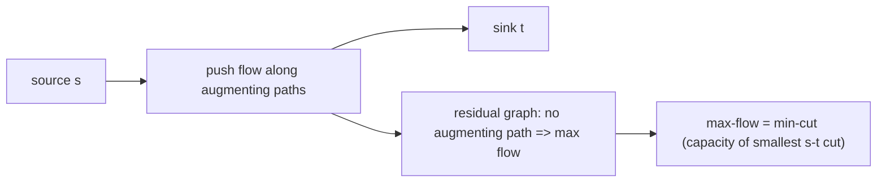

# Network Flow & Max-Flow Min-Cut

*(한국어: [네트워크 흐름과 최대유량-최소절단 (Network Flow, Max-Flow Min-Cut)](/portfolio/study/network-flow.ko/))*

> Push the most flow from source to sink; the maximum flow equals the minimum cut capacity.

## Idea
In a graph with edge **capacities**, a flow sends as much as possible from source $s$ to sink
$t$ without exceeding any capacity, conserving flow at every other vertex. **Ford-Fulkerson**
repeatedly finds an **augmenting path** in the residual graph and pushes flow along it.

## Why it matters
The **max-flow min-cut theorem** — max flow $=$ capacity of the smallest $s$-$t$ cut — is a
cornerstone of combinatorial optimization; flow models matching, scheduling, segmentation, and
connectivity.

## Details
**Edmonds-Karp** (BFS augmenting paths) runs in $O(VE^2)$. When no augmenting path remains,
the reachable set defines a min cut of equal value. Bipartite matching is the unit-capacity
special case.

## Diagram

## Related
[Bipartite Matching & Hall's Theorem](/portfolio/study/bipartite-matching/) · [Graph Representations](/portfolio/study/graph-representation/)
