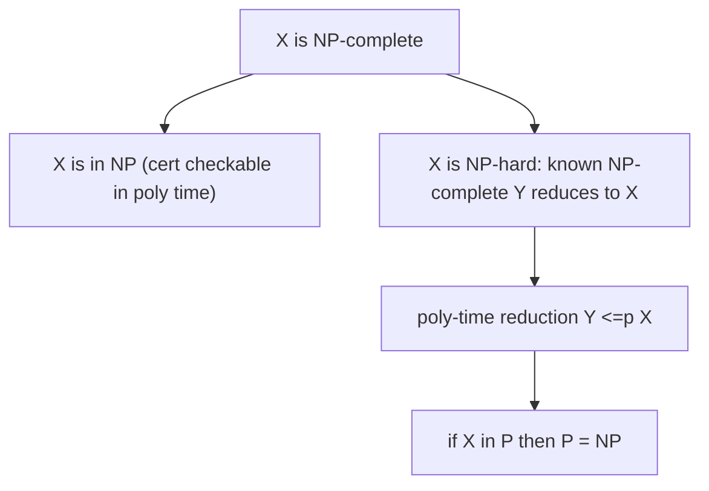

# NP-완전성과 환원 (NP-Completeness, Reductions)

*(English: [NP-Completeness & Reductions](/portfolio/study/np-completeness/))*

> 문제가 NP에 속하고 모든 NP 문제가 그것으로 환원되면 NP-완전이다; 하나만 다항에 풀려도 P=NP가 된다.

## 개념
**다항 시간 환원(reduction)** $A\le_p B$ 는 $A$ 의 사례를 $B$ 의 사례로 변환해, 빠른 $B$-해결기가
빠른 $A$-해결기를 낳게 한다. 모든 NP 문제가 환원되면 $B$ 는 **NP-난해**, 거기에
$B\in\text{NP}$ 면 **NP-완전**.

## 왜 중요한가
실용적 판정이다: 문제를 NP-완전으로 증명하면 정확한 다항 알고리즘을 좇지 말아야 함을 안다 —
근사·휴리스틱·제한 입력으로 전환한다.

## 세부
**쿡-레빈(Cook-Levin):** SAT 은 NP-완전. 거기서 환원이 3-SAT, 클리크, 정점 덮개, 해밀턴 순환,
부분집합 합 등으로 난해성을 퍼뜨린다. $X$ 를 NP-완전으로 증명하려면 $X\in$ NP 를 보이고 알려진
NP-완전 문제를 $X$ **로** 환원한다.

## 다이어그램

## 관련
[복잡도 클래스: P, NP, EXP (Complexity Classes)](/portfolio/study/complexity-classes.ko/) · [근사 알고리즘 (Approximation Algorithms)](/portfolio/study/approximation-algorithms.ko/)
