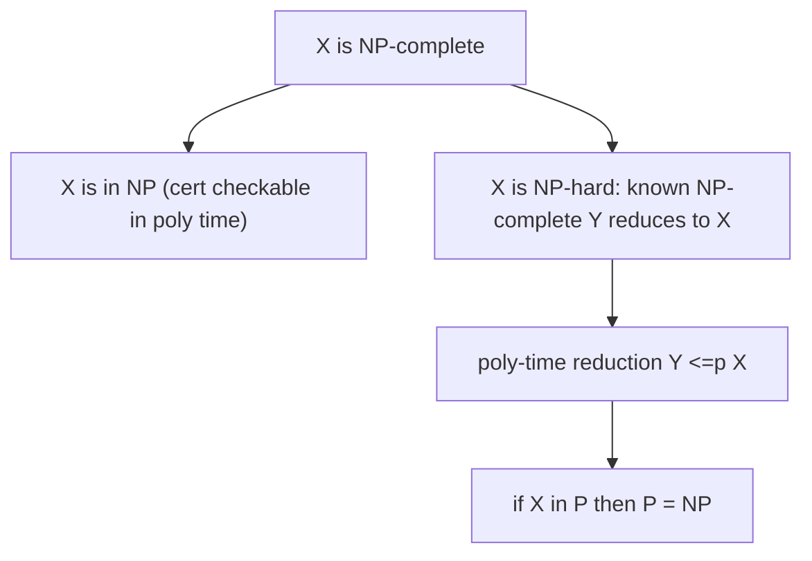

# NP-Completeness & Reductions

*(한국어: [NP-완전성과 환원 (NP-Completeness, Reductions)](/portfolio/study/np-completeness.ko/))*

> A problem is NP-complete if it is in NP and every NP problem reduces to it; one polynomial solution would collapse P=NP.

## Idea
A **polynomial-time reduction** $A\le_p B$ transforms instances of $A$ into instances of $B$ so
a fast $B$-solver yields a fast $A$-solver. $B$ is **NP-hard** if every NP problem reduces to
it, and **NP-complete** if also $B\in\text{NP}$.

## Why it matters
A practical verdict: prove your problem NP-complete and you know not to chase an exact
polynomial algorithm — pivot to approximation, heuristics, or restricted inputs.

## Details
**Cook-Levin:** SAT is NP-complete. From it, reductions spread hardness to 3-SAT, clique,
vertex cover, Hamiltonian cycle, subset sum, etc. To prove $X$ NP-complete: show $X\in$ NP and
reduce a known NP-complete problem **to** $X$.

## Diagram

## Related
[Complexity Classes: P, NP, EXP](/portfolio/study/complexity-classes/) · [Approximation Algorithms](/portfolio/study/approximation-algorithms/)
