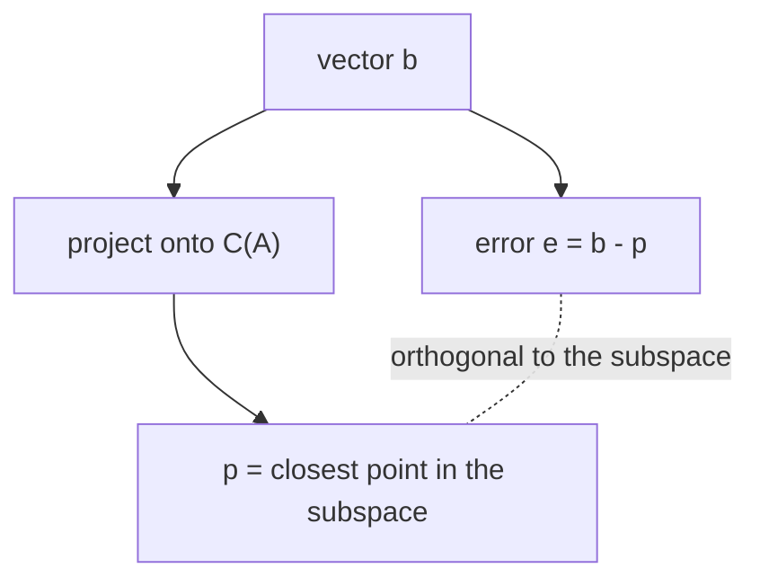

# 부분공간으로의 사영 (Projection)

*(English: [Projection onto a Subspace](/portfolio/study/projection/))*

> 부분공간에서 b에 가장 가까운 점. 사영 행렬 P = A(A^TA)^{-1}A^T로 주어진다.

## 개념
$b$ 의 부분공간으로의 **사영(projection)** 은 그 안에서 $b$ 에 가장 가까운 점이다. 오차
$b-p$ 는 부분공간에 직교한다. $A$ 의 열공간(열 독립)으로:
$$
P = A(A^TA)^{-1}A^T,\qquad p = Pb.
$$

## 왜 중요한가
사영은 [최소제곱](/portfolio/study/least-squares.ko/)의 기하적 엔진이다: $Ax=b$ 에 해가 없을 때 대신 사영
$p$ 를 구한다. 푸리에 급수와 정규직교 전개도 설명한다(각 기저 방향으로 사영).

## 세부
- $P$ 는 **대칭**이고 **멱등(idempotent)**: $P^T=P$, $P^2=P$.
- $a$ 를 지나는 직선으로의 사영: $P=\dfrac{aa^T}{a^Ta}$.
- $I-P$ 는 직교 보공간으로 사영한다.

## 다이어그램

## 관련
[최소제곱 (Least Squares)](/portfolio/study/least-squares.ko/) · [직교성과 직교 보공간 (Orthogonality)](/portfolio/study/orthogonality.ko/) · [그람–슈미트 직교화 (Gram–Schmidt)](/portfolio/study/gram-schmidt.ko/)
