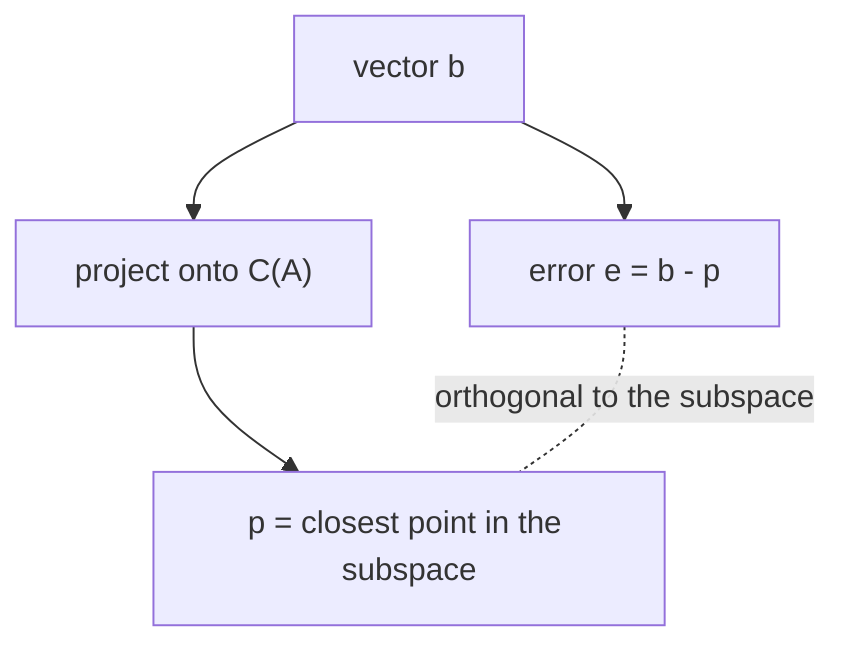

# Projection onto a Subspace

*(한국어: [부분공간으로의 사영 (Projection)](/portfolio/study/projection.ko/))*

> The closest point in a subspace to b; given by the projection matrix P = A(A^TA)^{-1}A^T.

## Idea
The **projection** of $b$ onto a subspace is the closest point in it to $b$; the error
$b-p$ is orthogonal to the subspace. Onto the column space of $A$ (independent columns):
$$
P = A(A^TA)^{-1}A^T,\qquad p = Pb.
$$

## Why it matters
Projection is the geometric engine of [Least Squares](/portfolio/study/least-squares/): when $Ax=b$ has no solution, solve
for the projection $p$ instead. It also explains Fourier series and orthonormal expansions
(project onto each basis direction).

## Details
- $P$ is **symmetric** and **idempotent**: $P^T=P$, $P^2=P$.
- Projecting onto a line through $a$: $P=\dfrac{aa^T}{a^Ta}$.
- $I-P$ projects onto the orthogonal complement.

## Diagram

## Related
[Least Squares](/portfolio/study/least-squares/) · [Orthogonality & Orthogonal Complements](/portfolio/study/orthogonality/) · [Gram–Schmidt Orthogonalization](/portfolio/study/gram-schmidt/)
