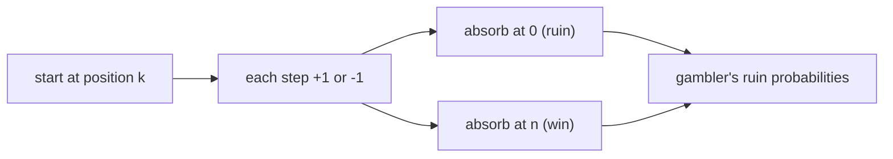

# 랜덤 워크와 도박꾼의 파산 (Random Walks, Gambler's Ruin)

*(English: [Random Walks & Gambler's Ruin](/portfolio/study/random-walks/))*

> 걷는 이가 무작위로 +/-1씩 움직이며, 도박꾼의 파산은 경계에 닿기까지의 확률과 시간을 계산한다.

## 개념
위치 $k$ 에서 시작; 각 단계 확률 $p$ 로 $+1$, $1-p$ 로 $-1$. **도박꾼의 파산** 은 $0$(파산)보다
먼저 $n$(승리)에 도달할 확률과 기대 단계 수를 묻는다.

## 왜 중요한가
가장 단순한 비자명 확률 과정 — 공정 게임, 큐 길이, 확산의 모델 — 이자 조건화와 확률 점화식을
깔끔하게 보여준다.

## 세부
**공정한** 워크($p=1/2$)에서 $0$ 과 $n$ 사이 $k$ 출발 시 승리 확률은 $k/n$, 기대 시간은
$k(n-k)$. 편향 워크는 기하적 공식을 준다; 워크는 1–2 차원에서 재귀적(recurrent), 3 차원
이상에서 일시적(transient)이다.

## 다이어그램

## 관련
[기댓값과 선형성 (Expectation, Linearity)](/portfolio/study/expectation.ko/) · [분산과 편차 한계 (Variance, Deviation Bounds)](/portfolio/study/variance-and-deviation.ko/)
