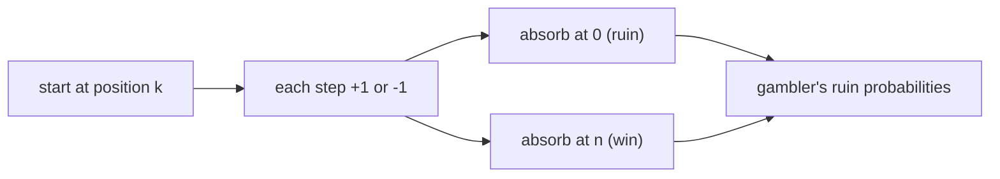

# Random Walks & Gambler's Ruin

*(한국어: [랜덤 워크와 도박꾼의 파산 (Random Walks, Gambler's Ruin)](/portfolio/study/random-walks.ko/))*

> A walker takes random +/-1 steps; gambler's ruin computes the probability and duration before hitting a boundary.

## Idea
Start at position $k$; each step go $+1$ with prob $p$, $-1$ with prob $1-p$. **Gambler's
ruin** asks the probability of reaching $n$ (win) before $0$ (ruin), and the expected number
of steps.

## Why it matters
The simplest nontrivial stochastic process — a model for fair games, queue lengths, and
diffusion — and a clean showcase of conditioning and recurrences for probabilities.

## Details
For a **fair** walk ($p=1/2$) starting at $k$ between $0$ and $n$, the win probability is
$k/n$ and the expected duration is $k(n-k)$. Biased walks give a geometric formula; the walk
is recurrent in 1–2 dimensions but transient in 3+.

## Diagram

## Related
[Expectation & Linearity](/portfolio/study/expectation/) · [Variance & Deviation Bounds](/portfolio/study/variance-and-deviation/)
