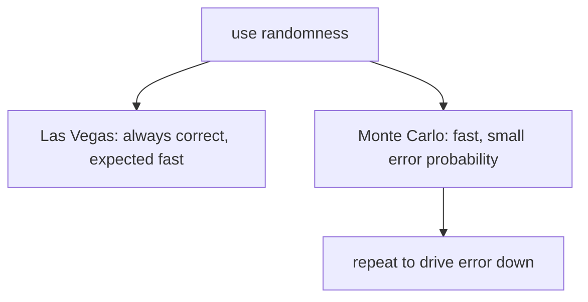

# 무작위 알고리즘 (Randomized Algorithms)

*(English: [Randomized Algorithms](/portfolio/study/randomized-algorithms/))*

> 속도·단순함을 위해 무작위 선택을 쓴다; 라스베이거스는 항상 옳고, 몬테카를로는 작은 확률로 틀린다.

## 개념
**무작위 알고리즘** 은 실행 중 동전을 던진다. **라스베이거스(Las Vegas):** 항상 올바른 답을
반환하되 실행시간이 무작위(예: 무작위 퀵정렬/퀵셀렉트). **몬테카를로(Monte Carlo):** 실행시간은
고정이나 틀릴 확률이 제한된다.

## 왜 중요한가
최선의 결정적 알고리즘보다 단순하고 빠를 때가 많으며, 때로는 유일한 실용적 접근이다 — 무작위성이
적대적 최악 입력을 무력화한다.

## 세부
**기대** 실행시간(기댓값의 선형성)이나 오류 확률로 분석한다. **프라이발즈 알고리즘** 은 무작위
벡터 하나로 행렬곱 $AB=C$ 를 $O(n^2)$ 에 검사하며 오류 확률 $\le 1/2$ — $k$ 번 반복하면
오류가 $2^{-k}$.

## 다이어그램

## 관련
[유니버설·완전 해싱 (Universal & Perfect Hashing)](/portfolio/study/universal-hashing.ko/) · [비무작위화 (Derandomization)](/portfolio/study/derandomization.ko/) · [선형 시간 선택 (중앙값들의 중앙값)](/portfolio/study/linear-time-selection.ko/)
