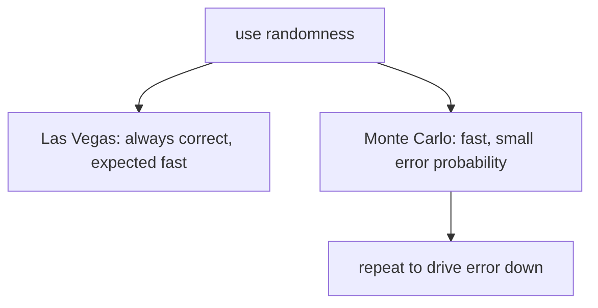

# Randomized Algorithms

*(한국어: [무작위 알고리즘 (Randomized Algorithms)](/portfolio/study/randomized-algorithms.ko/))*

> Use random choices for speed or simplicity; Las Vegas is always correct, Monte Carlo may err with small probability.

## Idea
A **randomized algorithm** flips coins during execution. **Las Vegas:** always returns the
correct answer, with running time random (e.g. randomized quicksort/quickselect). **Monte
Carlo:** fixed running time but a bounded probability of a wrong answer.

## Why it matters
Often simpler and faster than the best deterministic algorithm, and sometimes the only
practical approach — randomness defeats adversarial worst-case inputs.

## Details
Analyze via **expected** running time (linearity of expectation) or error probability.
**Freivalds' algorithm** checks a matrix product $AB=C$ in $O(n^2)$ with one random vector,
erring with probability $\le 1/2$ — repeat $k$ times to push error to $2^{-k}$.

## Diagram

## Related
[Universal & Perfect Hashing](/portfolio/study/universal-hashing/) · [Derandomization](/portfolio/study/derandomization/) · [Linear-Time Selection (Median of Medians)](/portfolio/study/linear-time-selection/)
