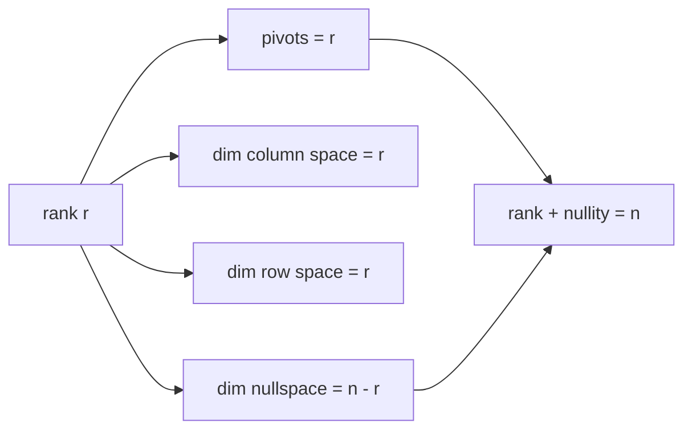

# 랭크 (Rank)

*(English: [Rank](/portfolio/study/rank/))*

> 피벗의 개수 = 열공간의 차원 = 독립인 행/열의 개수. 풀이 가능성을 지배한다.

## 개념
$A$ 의 **랭크(rank)** $r$ 은 소거 후 피벗의 개수 — 즉 $\dim C(A) = \dim C(A^T)$ (행 랭크 =
열 랭크)다. 해집합의 모양을 결정하는 단 하나의 수다.

## 왜 중요한가
**랭크–nullity 정리**: $m\times n$ 행렬에 대해
$$
\operatorname{rank}(A) + \dim N(A) = n.
$$
**풀랭크(full rank)** 는: 열 풀랭크($r=n$, 유일해 / 독립인 열) 또는 행 풀랭크($r=m$, 항상
풀림)를 뜻한다. 정사각 풀랭크 = 가역.

## 세부
- 네 부분공간의 차원은 $r,\,n-r,\,r,\,m-r$ ([네 기본 부분공간 (Four Fundamental Subspaces)](/portfolio/study/four-fundamental-subspaces.ko/)).
- [rank-1 행렬](/portfolio/study/rank-one-matrix.ko/)($r=1$)은 $uv^T$. 임의의 행렬은 $r$ 개의 rank-1 조각의 합.

## 다이어그램

## 관련
[네 기본 부분공간 (Four Fundamental Subspaces)](/portfolio/study/four-fundamental-subspaces.ko/) · [독립·기저·차원 (Independence, Basis, Dimension)](/portfolio/study/independence-basis-dimension.ko/) · [Ax = b의 완전해 (Complete Solution)](/portfolio/study/complete-solution-ax-b.ko/)
