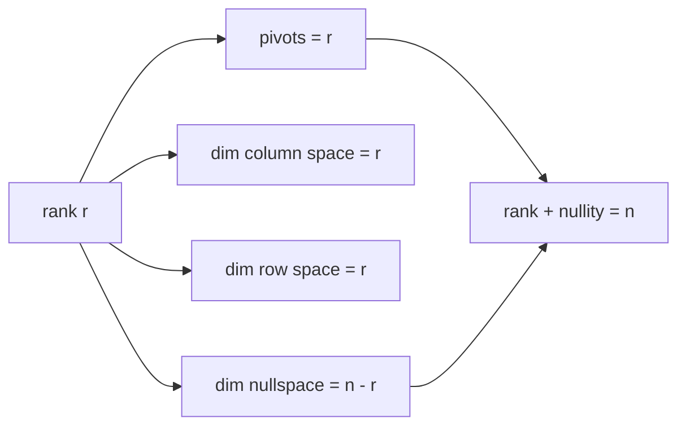

# Rank

*(한국어: [랭크 (Rank)](/portfolio/study/rank.ko/))*

> The number of pivots = dimension of the column space = number of independent rows/columns; it governs solvability.

## Idea
The **rank** $r$ of $A$ is the number of pivots after elimination — equivalently
$\dim C(A) = \dim C(A^T)$ (row rank = column rank). It is the single number that decides
the shape of the solution set.

## Why it matters
The **rank–nullity theorem**: for an $m\times n$ matrix,
$$
\operatorname{rank}(A) + \dim N(A) = n.
$$
**Full rank** means: full column rank ($r=n$, unique solutions / independent columns) or
full row rank ($r=m$, always solvable). Square full-rank = invertible.

## Details
- The four subspace dimensions are $r,\,n-r,\,r,\,m-r$
  ([The Four Fundamental Subspaces](/portfolio/study/four-fundamental-subspaces/)).
- A [Rank-One Matrices](/portfolio/study/rank-one-matrix/) ($r=1$) is $uv^T$; any matrix is a sum of $r$ rank-one pieces.

## Diagram

## Related
[The Four Fundamental Subspaces](/portfolio/study/four-fundamental-subspaces/) · [Independence, Basis, Dimension](/portfolio/study/independence-basis-dimension/) · [Complete Solution of Ax = b](/portfolio/study/complete-solution-ax-b/)
