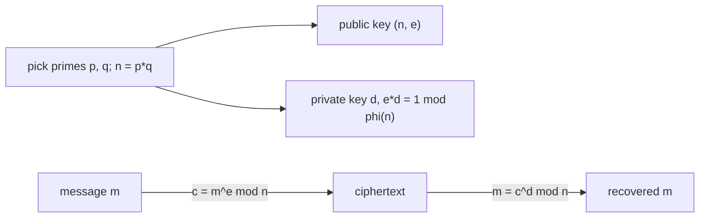

# RSA 공개키 암호 (RSA Public-Key Cryptography)

*(English: [RSA Public-Key Cryptography](/portfolio/study/rsa-cryptosystem/))*

> 모듈러 거듭제곱 위에 세운 공개키 암호; 안전성은 n=pq의 소인수분해 어려움에 의존한다.

## 개념
소수 $p,q$ 를 골라 $n=pq$, $\phi(n)=(p-1)(q-1)$ 로 둔다. $\phi(n)$ 과 서로소인 공개 $e$ 와
$ed\equiv 1\pmod{\phi(n)}$ 인 비밀 $d$ 를 택한다. 암호화 $c=m^e\bmod n$, 복호화
$m=c^d\bmod n$.

## 왜 중요한가
누구나 **공개** 키 $(n,e)$ 로 암호화하지만 $d$ 를 가진 사람만 복호화한다. 정당성은 오일러
정리에서, 안전성은 $n$ 의 소인수분해가 어렵다는 믿음에서 나온다.

## 세부
$d$ 는 $e$ 와 $\phi(n)$ 으로부터 확장 유클리드로 계산되므로 $\phi(n)$(즉 $p,q$)는 비밀이어야
한다. 빠른 거듭제곱이 암복호화를 실용적으로 만든다.

## 다이어그램

## 관련
[모듈러 산술 (Modular Arithmetic)](/portfolio/study/modular-arithmetic.ko/) · [나누어떨어짐·최대공약수·유클리드 호제법](/portfolio/study/divisibility-and-gcd.ko/)
