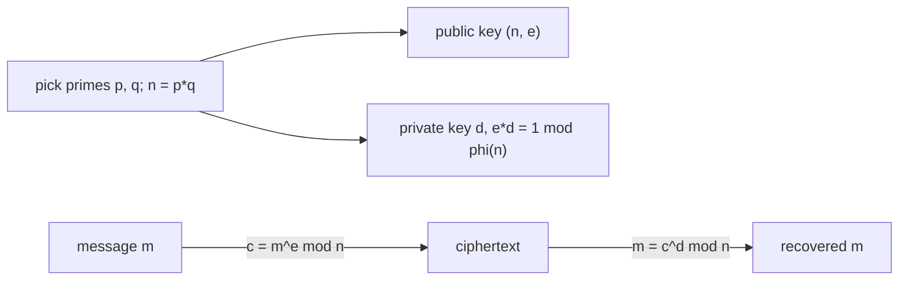

# RSA Public-Key Cryptography

*(한국어: [RSA 공개키 암호 (RSA Public-Key Cryptography)](/portfolio/study/rsa-cryptosystem.ko/))*

> Public-key encryption built on modular exponentiation; security rests on the hardness of factoring n=pq.

## Idea
Pick primes $p,q$, set $n=pq$ and $\phi(n)=(p-1)(q-1)$. Choose public $e$ coprime to
$\phi(n)$ and private $d$ with $ed\equiv 1\pmod{\phi(n)}$. Encrypt $c=m^e\bmod n$, decrypt
$m=c^d\bmod n$.

## Why it matters
Anyone can encrypt with the **public** key $(n,e)$; only the holder of $d$ can decrypt.
Correctness follows from Euler's theorem; security from the belief that factoring $n$ is hard.

## Details
$d$ is computed from $e$ and $\phi(n)$ by extended Euclid — which is why $\phi(n)$ (hence
$p,q$) must stay secret. Fast exponentiation makes encrypt/decrypt practical.

## Diagram

## Related
[Modular Arithmetic](/portfolio/study/modular-arithmetic/) · [Divisibility, GCD & the Euclidean Algorithm](/portfolio/study/divisibility-and-gcd/)
