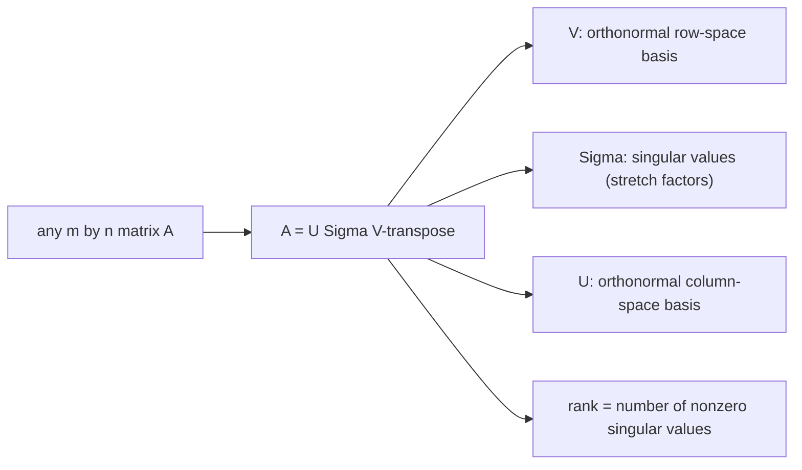

# 특이값 분해 (SVD)

*(English: [Singular Value Decomposition (SVD)](/portfolio/study/singular-value-decomposition/))*

> 임의의 행렬을 A = UΣV^T로 분해. U,V는 직교, Σ는 비음수 대각. 모든 분해의 으뜸.

## 개념
모든 $m\times n$ 행렬은
$$
A = U\Sigma V^T
$$
로 분해된다. $U$ ($m\times m$), $V$ ($n\times n$)는 직교, $\Sigma$ 는 **특이값(singular
value)** $\sigma_1\ge\sigma_2\ge\dots\ge0$ 을 가진 대각이다. $\sigma_i$ 는 $A^TA$ 고유값의
제곱근이고, $V$/$U$ 의 열은 그 고유벡터/그 상(image)이다.

## 왜 중요한가
가장 일반적이고 가장 안정적인 분해 — **임의의** 행렬(직사각, 랭크 결손)에 작동한다. 모든
것을 드러낸다: $\operatorname{rank}$ = 0 아닌 $\sigma$ 수, [[four-fundamental-subspaces.ko|네
부분공간]] 모두의 정규직교 기저, [유사역행렬](/portfolio/study/pseudoinverse.ko/), 그리고 최적 저랭크 근사(상위
$\sigma$ 유지 → 이미지 압축).

## 세부
- $A=\sum_i \sigma_i u_i v_i^T$ — 중요도 순으로 정렬된 [rank-1](/portfolio/study/rank-one-matrix.ko/) 조각의 합.
- 대칭 양의정부호 $A$ 에서는 SVD = 고유분해.
- 상위 $k$ 개 특이값으로 자르면 최적 랭크 $k$ 근사(에카르트–영, Eckart–Young).

## 다이어그램

## 관련
[유사역행렬 (Pseudoinverse)](/portfolio/study/pseudoinverse.ko/) · [네 기본 부분공간 (Four Fundamental Subspaces)](/portfolio/study/four-fundamental-subspaces.ko/) · [rank-1 행렬 (Rank-One Matrices)](/portfolio/study/rank-one-matrix.ko/)
