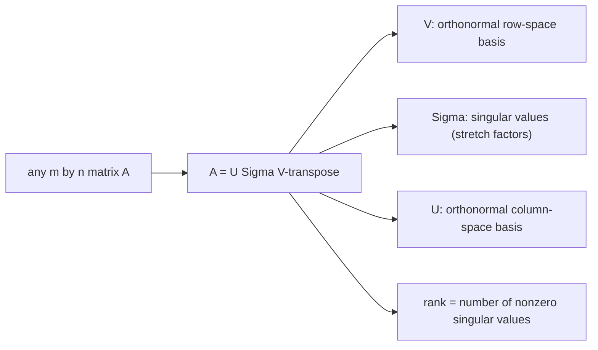

# Singular Value Decomposition (SVD)

*(한국어: [특이값 분해 (SVD)](/portfolio/study/singular-value-decomposition.ko/))*

> Any matrix factors as A = UΣV^T with orthogonal U,V and nonnegative diagonal Σ; the master factorization.

## Idea
Every $m\times n$ matrix factors as
$$
A = U\Sigma V^T,
$$
with $U$ ($m\times m$) and $V$ ($n\times n$) orthogonal and $\Sigma$ diagonal with
**singular values** $\sigma_1\ge\sigma_2\ge\dots\ge0$. The $\sigma_i$ are square roots of
eigenvalues of $A^TA$; columns of $V$ / $U$ are its eigenvectors / their images.

## Why it matters
The most general and most stable factorization — works for **any** matrix (rectangular,
rank-deficient). It exposes everything: $\operatorname{rank}$ = # nonzero $\sigma$, gives
orthonormal bases for all [The Four Fundamental Subspaces](/portfolio/study/four-fundamental-subspaces/), the [Pseudoinverse](/portfolio/study/pseudoinverse/), and optimal
low-rank approximation (keep the top $\sigma$'s → image compression).

## Details
- $A=\sum_i \sigma_i u_i v_i^T$ — a sum of [rank-one](/portfolio/study/rank-one-matrix/) pieces ordered by
  importance.
- For symmetric positive definite $A$, SVD = eigendecomposition.
- Truncating to the largest $k$ singular values is the best rank-$k$ approximation
  (Eckart–Young).

## Diagram

## Related
[Pseudoinverse](/portfolio/study/pseudoinverse/) · [The Four Fundamental Subspaces](/portfolio/study/four-fundamental-subspaces/) · [Rank-One Matrices](/portfolio/study/rank-one-matrix/)
