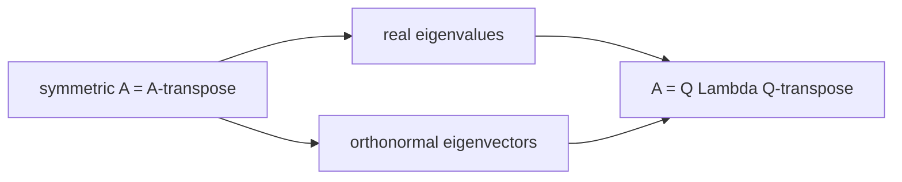

대칭 행렬과 스펙트럼 정리 (Symmetric Matrices)

*(English: [Symmetric Matrices & the Spectral Theorem](/portfolio/study/symmetric-matrix/))*

> A=A^T는 실수 고유값과 정규직교 고유벡터를 가진다: A = QΛQ^T (스펙트럼 정리).

## 개념
**대칭 행렬(symmetric matrix)** 은 $A=A^T$ 를 만족한다. **스펙트럼 정리(spectral theorem)** 는
그 고유값이 **실수**이고 고유벡터를 **정규직교**로 고를 수 있다고 말한다. 따라서
$$
A = Q\Lambda Q^T,\qquad Q\text{ 직교},\ \Lambda\text{ 실수 대각}.
$$

## 왜 중요한가
대칭 행렬은 가장 행실 좋은 행렬이다: 항상 [직교 행렬](/portfolio/study/orthogonal-matrix.ko/)로 대각화된다.
이차형식·공분산·에너지를 모델링하고, [양의정부호](/portfolio/study/positive-definite.ko/)와
[SVD](/portfolio/study/singular-value-decomposition.ko/)로 곧장 이어진다.

## 세부
- 고유값의 부호 = 피벗의 부호(빠른 판정).
- $A^TA$, $AA^T$ 는 항상 대칭(준양의정부호) — SVD의 출발점.
- 서로 다른 고유값 ⇒ 고유벡터가 자동으로 직교.

## 다이어그램

## 관련
[양의정부호 행렬 (Positive Definite Matrices)](/portfolio/study/positive-definite.ko/) · [직교 행렬 (Orthogonal Matrix)](/portfolio/study/orthogonal-matrix.ko/) · [특이값 분해 (SVD)](/portfolio/study/singular-value-decomposition.ko/)
